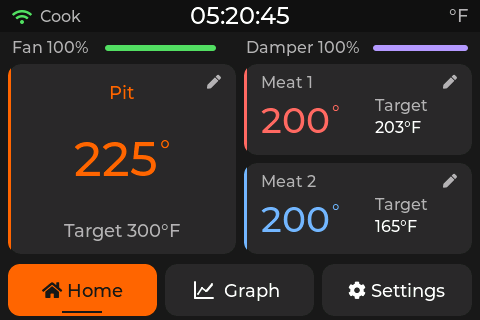

#  Pit Claw

[](https://github.com/yevgenb/pitclaw/actions/workflows/ci.yml)

BBQ temperature monitor and controller built around the WT32-SC01 Plus: an
ESP32-S3 with a 3.5-inch, 480×320 landscape capacitive touchscreen. Pit Claw reads
one pit probe and two meat probes, controls a blower and optional servo damper,
and provides a web dashboard for monitoring and control. The touchscreen and
temperature control work without Wi-Fi.

## Current project state

As of **9 September 2026**:

| Area | State |
| --- | --- |
| Firmware | Version **0.2.0**, built and flashed to a WT32-SC01 Plus; upload verified and the device responded after reboot. |
| Touchscreen | LVGL Home, Graph, Settings, temperature editors, shared alarms, and first-boot setup are implemented. The latest polish is included in the flashed build. |
| Web interface | Live temperatures, history and prediction graphs, session controls/export, settings, and manual firmware OTA. Supports deployment under an Nginx path prefix. |
| Carrier PCB | **Rev B-T2F0-A5807-S4** routed prototype. Recorded KiCad ERC, DRC, schematic parity, and unconnected-item checks pass. A reviewed bare-board fabrication package is available; physical qualification remains. |
| Enclosure | **r7 landscape fit prototype**, with exported STLs, fit coupons, and a print guide. Physical module and printed-part fit still need verification. |

The firmware and simulator builds, **132 native test cases**, and the headless
LVGL checks passed on 8 September 2026. The LVGL checks include 123 navigation
taps and editor, unit, alarm, probe-state, and layout transitions. This validation
does not establish smoker temperature accuracy or qualify the new carrier's
electrical loads, thermal behavior, or physical fit.

## Touchscreen



The current dashboard uses large temperature readings, rounded cards and
navigation buttons, neutral status labels, and consistent edit icons. Smaller
degree symbols follow changing values and disappear for disconnected probes.
The image above is a native 480×320 LVGL render with example readings.

- Tap the pit card to change its setpoint, or a meat card to edit that probe's
  target. Tap for one-degree steps or hold for five-degree steps; Cancel discards
  the draft value.
- Switch between Fahrenheit and Celsius without changing the stored control
  targets. Graph history uses elapsed sample time and a dashed setpoint line.
- Alarm controls remain available on Home, Graph, Settings, and above an open
  editor. Disconnected probes display dashes.
- Setup provides Back navigation, Wi-Fi connection feedback, live probe checks,
  and separate fan, servo, and buzzer test buttons.

## Control and monitoring

- **Three probe inputs:** one pit and two meat channels, using calibrated
  thermistor probes with 2.5 mm jacks. Thermoworks Pro-Series is the intended
  probe family; other probes require suitable coefficients and calibration.
- **PID control:** fan-only, fan-and-damper, and damper-priority modes, with
  startup handling, lid-open detection, and output shutdown on a pit-probe fault.
- **Alarms:** local buzzer, browser audio, and configurable Pushover notifications.
- **Cook sessions:** temperature history, predicted meat completion times, and
  CSV/JSON export. Download a session before starting a new one.
- **Configuration:** persistent settings, probe calibration, and Wi-Fi reconnect.

## Web interface


Open `http://bbq.local` or the controller's LAN IP from a device on the same
network. The dashboard uses WebSocket updates and also works behind an Nginx
directory prefix such as `/newbbq/`; see the
[reverse-proxy guide](firmware/docs/reverse-proxy.md).

PWA installation, service-worker caching, and browser notifications need a secure
context; use HTTPS on the reverse proxy for those features. Live readings still
require a connection to the controller.

Manual firmware updates are available at `/update`. Automatic GitHub release
checks are disabled in the current PlatformIO configuration. Firmware and web
assets are separate: uploading `firmware.bin` does not update the files in
LittleFS.

## Hardware and enclosure

The active design is the
[Rev B-T2F0-A5807-S4 carrier](hardware/carrier-revb/README.md), a 60×92 mm board
with PCB-mounted probe jacks, a blower/servo connector, a 12 V barrel inlet,
an Adafruit 5807 USB-C PD module, and a Traco TSR 2-2450N 5 V / 2 A converter.
A relay selects wall power when present and USB-PD otherwise.

| Resource | Contents |
| --- | --- |
| [Carrier design](hardware/carrier-revb/README.md) | Circuit, power limits, module mounting, and remaining qualification work |
| [Wiring guide](docs/wiring.md) | Current connector pin assignments and assembly wiring |
| [Carrier BOM](hardware/carrier-revb/bom/README.md) | Current parts and recorded pricing |
| [Verification](hardware/carrier-revb/verification/README.md) | Native electrical/layout checks and physical validation limits |
| [JLCPCB prototype package](hardware/carrier-revb/fabrication/jlcpcb-2026-09-06/README.md) | Reviewed Gerber/drill archive for a small bare-board order |
| [Landscape enclosure](enclosure/carrier-case.md) | Current 104×86×44.9 mm case and fit assumptions |
| [r7 STL package and print guide](enclosure/print/carrier-r7/README.md) | Top, bottom, display retainer, fit coupons, and printing instructions |

The fabrication documentation records no submitted PCB order. Carrier load,
relay-transfer, thermal, and module-fit checks remain, along with printed
enclosure fit checks. The older 50×70 mm perfboard and snap-fit controller case
are legacy designs; their parts do not fit the Rev B carrier. See the
[enclosure guide](enclosure/README.md) for that distinction and the separate
fan/damper assembly.

## Getting started

### 1. Set up the tools

```sh
git clone https://github.com/yevgenb/pitclaw.git
cd pitclaw
```

Install PlatformIO CLI. Windows users can use the repository's setup script:

```powershell
# Run from an elevated PowerShell in the repository root
powershell -ExecutionPolicy Bypass -File scripts\setup-dev.ps1
```

See [firmware development](docs/firmware-development.md) for prerequisites.
Use the current carrier and wiring guides when assembling hardware.

### 2. Build and flash

Run from `firmware/` with the WT32-SC01 Plus connected over USB:

```sh
cd firmware
pio run -e wt32_sc01_plus
pio run -e wt32_sc01_plus --target upload

# Initial installation of the web assets in LittleFS
pio run -e wt32_sc01_plus --target uploadfs
```

For an existing installation, a filesystem upload replaces LittleFS: preserve
configuration and session data before updating its image. A firmware-only update
preserves that filesystem. The display board's programming USB port requires
opening the enclosure; the carrier's external USB-C PD port is for power.

For later manual firmware OTA, open `http://bbq.local/update` and upload
`firmware/.pio/build/wt32_sc01_plus/firmware.bin` from the repository root.

### 3. Complete setup

1. Select °F or °C in the touchscreen wizard.
2. Follow the Wi-Fi QR code and portal instructions, or continue offline with Next.
3. Connect the probes and check their live readings.
4. Tap the fan, servo, and buzzer test buttons and confirm each device operates.
5. Finish setup to enter the dashboard.

Hold a finger on the touchscreen for 10 seconds during the boot splash to request
a factory reset.

## Development and validation

The SDL2 desktop simulator runs the production LVGL screens and serves the web
UI at `http://localhost:3000`. Run these commands from `firmware/`:

```sh
# Native control-logic regression tests
pio test -e native

# Desktop simulator; requires SDL2
pio run -e simulator
.pio/build/simulator/program

# Headless production LVGL interaction checks; run after building the simulator
python3 test/ui/run_checks.py

# Web update and reverse-proxy checks
node test/web/test_release_updates.cjs
node test/web/test_reverse_proxy.cjs
```

On Apple Silicon with Homebrew SDL2, use
`CPATH=/opt/homebrew/include pio run -e simulator` if the headers are not found.
The [display test guide](firmware/test/ui/README.md) explains the capture command
and alternate SDL paths. UI screenshots can be regenerated locally on demand.

| Guide | Topics |
| --- | --- |
| [Firmware development](docs/firmware-development.md) | Build, flash, architecture, and configuration |
| [Display checks](firmware/test/ui/README.md) | Real LVGL pointer events, layout checks, and PNG capture |
| [Web UI development](docs/web-development.md) | Simulator profiles, web assets, and WebSocket protocol |
| [Reverse proxy](firmware/docs/reverse-proxy.md) | Nginx path prefixes, WebSockets, HTTPS, and manual OTA routing |
| [3D printed parts](enclosure/README.md) | Current enclosure, legacy parts, and fan assembly |

## License

TBD
