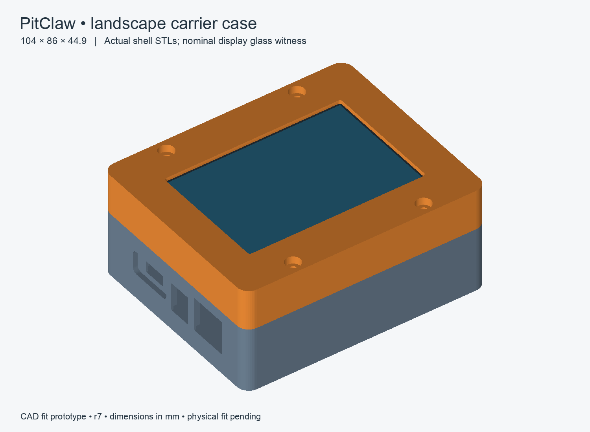
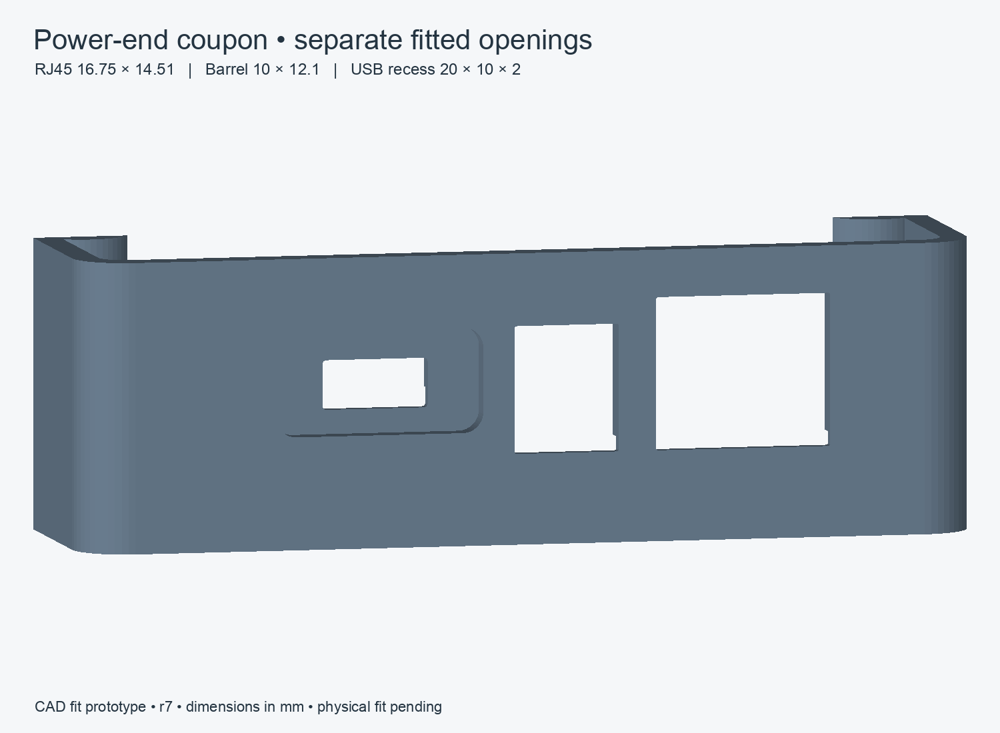
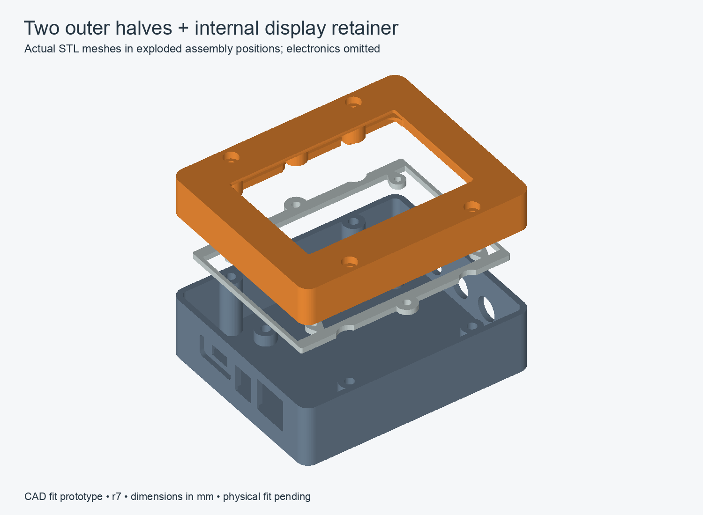

# Landscape carrier enclosure — fit prototype r7

The Rev B carrier case has **two outer halves**, a top bezel and a bottom shell,
plus a thin internal display retainer. The WT32 mounts inside the top, with a
raised rim protecting its front and sides. The carrier mounts independently in
the bottom. The outer size remains **104 × 86 × 44.9 mm** in landscape orientation.

**CAD fit checks pass; physical fit is still pending.** The final routed carrier
was used for this review. Its PCB, project and existing JLCPCB fabrication ZIP
were preserved. These are print-ready meshes for a fit prototype, not a
physically qualified enclosure.

[Download the five STL files and print guide](print/carrier-r7/pitclaw-carrier-case-r7.zip).
Start with the two coupons using the [0.4 mm nozzle print guide](print/carrier-r7/README.md).

## Connector fit

All power connections occupy one short end: RJ45 fan/servo, 12 V barrel inlet and
USB-C. Three probe jacks occupy the opposite short end. Individual openings leave
solid plastic between the connectors. RJ45 and barrel faces remain nominally
flush with the case. USB-C is flush with the floor of a shallow exterior recess.

| Feature | r7 geometry, mm |
|---|---:|
| RJ45 opening, width × height | 16.75 × 14.51 |
| Barrel opening, width × height | 10 × 12.1 |
| USB exterior recess, width × height × depth | 20 × 10 × 2, R2 corners |
| USB fitted shell opening | 10.14 × 4.7 |
| Three probe openings | Ø10.5 |
| Probe bore axis above nominal carrier PCB top | 2.55 |
| Probe face recess | 7.5 |
| Carrier mounting pattern | 51 × 58, four M3 mounts |
| USB module mounting pattern | 15.24, two M2 mounts |

The USB recess and its internal backing move upward 0.5 mm in r7, leaving an
0.8 mm web above the carrier-edge channel. The actual USB socket axis stays in
place, so the recess has 4.5 mm below and 5.5 mm above that axis. A centered
18 × 8 mm cable boot fits the nominal rounded outline with only modest corner
clearance; test the actual cable and full insertion depth with the power coupon.

The backing has a nominal 1.5 mm floor. Hidden PCB and spacer/head reliefs leave
minimum local skins of 0.943 and 0.983 mm. The separate carrier-edge channel now
has 0.5 mm XY/Z allowance and retains 1.0 mm of exterior plastic. No hidden relief
opens to the outside. These thin areas need inspection in the slicer and on the
coupon; printer error is not included in every mechanical tolerance margin.

The probe-axis correction uses the center of the manufacturer's 5.10 mm-high
housing, giving 2.55 mm rather than the previous 3.5 mm assumption. This is an
inference from the drawing, subject to actual jack seating on the PCB. Check the
purchased probe plug overmolds can reach the recessed sockets and seat fully.

The KiCad interface uses a 60 × 92 × 1.6 mm carrier. In its component-side view,
M3 holes are at (4.5,4.5), (55.5,4.5), (4.5,62.5), (55.5,62.5); USB module holes
are at (36.753,87.817), (51.993,87.817). RJ45, barrel and USB faces are at
(9.5,93.5), (26.5,93.5), (44.5,91.5). Probe mouths are at X13/30/47, Y−3.
The board sits 4.5 mm toward the power end relative to the display.

## Display and vertical stack

| Datum from the bottom exterior | Z, mm |
|---|---:|
| Floor top | 2.5 |
| Carrier underside / nominal PCB top | 7.5 / 9.1 |
| General component/harness ceiling | 25.1 |
| Case seam | 27.6 |
| Retainer underside / top | 30.1 / 32.6 |
| Display glass front | 43.4 |
| Outer bezel front | 44.9 |

The 16 mm general component budget covers conservative placed envelopes; Q1
must lie flat within its 6.5 mm allowance. K1 is modeled separately at 16.2 mm
seated height and retains 2.8 mm nominal clearance to the reserved display rear
stack, or 2.64 mm with the checked maximum carrier thickness. Mated JST wires
must turn sideways and the complete socketed ADC must remain within the 16 mm
budget. The WT32's 10.8 mm glass-to-rear-boss datum does not establish its maximum
rear connector or cable height.

The 2.5 mm internal retainer retains its 1.6 mm end rails and original outer
length to preserve the locating lip. The top's display pocket is now 61.2 ×
93.2 mm; the retainer opening remains 60.8 × 92.8 mm. Four small screws enter the
WT32's **rear blind bosses**, and two M3 screws hold the retainer to inserts in
the top. Four separate closure screws join the outer halves.

Hard stops set the mounting plane. A compliant strip touches only the inactive
glass border; 0.3 mm compressed thickness is provisional. Measure the display,
blind-boss depth and strip preload so tightening screws cannot bend the glass.
The WT32 programming port remains accessible by opening the case. Leave a
service loop and keep wiring clear of the seam and screw columns.

## Review and verification

Independent carrier and enclosure reviews challenged the hidden clearances,
missing component models, hardware stack, printability and assembly path. r7:

- Enlarges internal carrier/USB clearances for declared thickness variation.
- Adds the full USB spacers and their hidden relief, which resolved a real clash.
- Corrects the probe bore axis and increases display pocket clearance.
- Replaces an incomplete central clearance block with 31 placed component
  envelopes, plus dedicated relay, external connector and USB models. U2 includes
  its body dimension tolerance. All 109 underside pad/peg envelopes are retained.
- Supplies exact power-end and M3 insert coupons for the selected printer/material.

[The final report](print/carrier-r7/fit-verification.json) records 12 passing
geometric checks: nominal display insertion, populated-carrier installation,
electronics closure and shell closure, plus eight high/low stack and lateral
placement cases. Eleven intersections are empty; shell closure contains only
intentional coplanar contact at the Z27.6 seam, with zero thickness/volume.
All five print meshes are single connected, watertight solids with consistent
winding, positive volume, expected dimensions and their base at Z0.

The tolerance cases use carrier and USB PCB thicknesses 1.44–1.76 mm, USB spacers
2.9–3.1 mm, carrier edge growth of 0.2 mm and USB lateral movement of ±0.2 mm.
Production case geometry stays nominal. The USB opening has about 0.18 mm
vertical and 0.4 mm lateral clearance at the declared stack extremes, before
printer error. Other component heights, mated plugs, wire bends and WT32 rear
parts remain sample-based checks, not supplier-complete tolerance analyses.

No physical print, printer-specific slicing, thermal qualification or weather
seal test was performed. Use the coupons first, then check empty-shell assembly,
all hardware, display preload, cable reach and populated-carrier installation.

## Source and reproduction

- [OpenSCAD source](carrier-case.scad) and [generated carrier interface](carrier-interface.scad)
- [Print orientations, hardware and assembly](print/carrier-r7/README.md)
- [Final independent review](print/carrier-r7/final-review.md)
- [Repeatable geometry/mesh verifier](tools/verify_case.py)
- [STL-based preview renderer](tools/render_case.py)

To refresh the interface, run `hardware/carrier-revb/tools/export_enclosure_interface.py`
with KiCad 9 Python. It reads the existing routed PCB; do not run the draft board
generator merely to refresh the case. Export the five part names `top`, `bottom`,
`retainer`, `fit-coupon`, `insert-coupon` from `carrier-case.scad`, then run the
verifier with Python, trimesh and OpenSCAD installed. The old `review/*-draft.*`
files and their verification report are historical r6 artifacts.

Geometry references: [WT32-SC01 Plus V1.3 manual](https://github.com/janick/WT32-SqLn/blob/main/docs/WT32-SC01-Plus-V1.3-EN.pdf),
[Ruthex short M3 insert](https://www.ruthex.de/products/ruthex-gewindeeinsatz-m3s-100stuck-rx-m3x4-0-short-messing-gewindebuchsen-fur-3d-druck),
[Same Sky MJ1-2503A drawing, page 2](https://www.sameskydevices.com/product/resource/mj1-2503a.pdf),
[Tensility barrel jack](https://tensility.s3.us-west-2.amazonaws.com/imports/product_spec_sheets/54-00133.pdf),
[Amphenol RJ45](https://cdn.amphenol-cs.com/media/wysiwyg/files/drawing/rjhsex080.pdf),
[Adafruit module CAD](https://github.com/adafruit/Adafruit-USB-Type-C-Power-Delivery-Dummy-Breakout-PCB).
