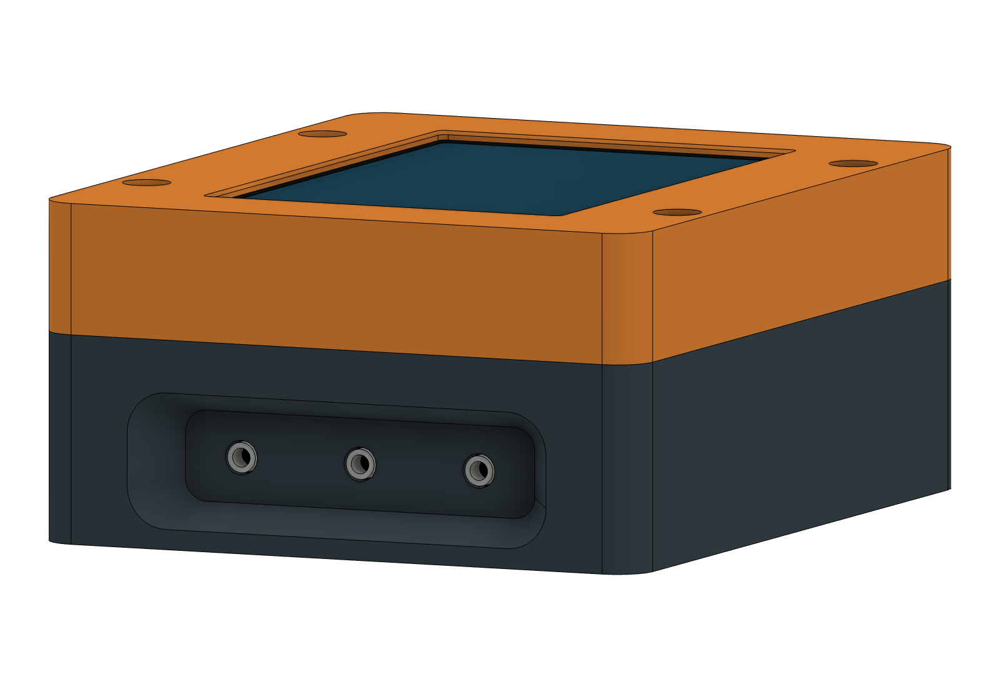

# Rounded probe pocket — appearance alternative

This separate Fusion concept keeps the continuous rectangular outer silhouette.
A single rounded, tapered pocket surrounds the three probe jacks. The outer
opening is 60×18 mm and the floor is 50×12 mm, at 7.5 mm depth.

The jack mouths are level with the pocket floor. **They remain 7.5 mm behind the
outermost case face.** This is an appearance/access alternative to the full-width
step, not a reduction of the 104×86×44.9 mm overall envelope.

The PCB, display, top, retainer and power side remain in their r9 positions.
Actual plug boot fit, complete insertion, fascia assembly/removal, printing and
strength are not yet verified. No production CAD or STL files were replaced.

[Fusion concept](rounded-probe-pocket-CONCEPT.f3d) · [Isometric view](rounded-probe-pocket.png)

The native Fusion loft and profiles are created by `render_concept.py` in a new
document imported from the unchanged r9 archive. This file is an appearance
study, not a released printable enclosure.

The confirmed mating probe is **ThermoWorks Pro-Series**. The user supplied a
ruler photo of the actual connector. Its front molded body appears about
8.5–9.5 mm across in that side view, fitting the 12 mm floor opening. The
cable-side bend grows to roughly 9 mm from the shaft axis near the 7.5 mm entry
plane, matching the current 9 mm available half-height with little demonstrated
margin. The cable center is about 11 mm behind the shoulder, largely outside
the case, so the photo does not establish a definite collision.

This is a **borderline photo-based fit**, not verified full seating. Allow about
1 mm extra clearance in the cable-exit direction and check the actual shoulder
seating before approving the recess. CAD, images and print files have not been
changed by this measurement review. See `concept-notes.json` for the estimates.

[Proposed lip clearance section](lip-clearance-section.png) shows how lowering
the outer lower lip by 1 mm gives the cable elbow clearance while the socket and
PCB stay fixed. The remaining local lip is 1.65 mm high. This proposal assumes
cables point toward the case bottom and has not been applied to the CAD.
