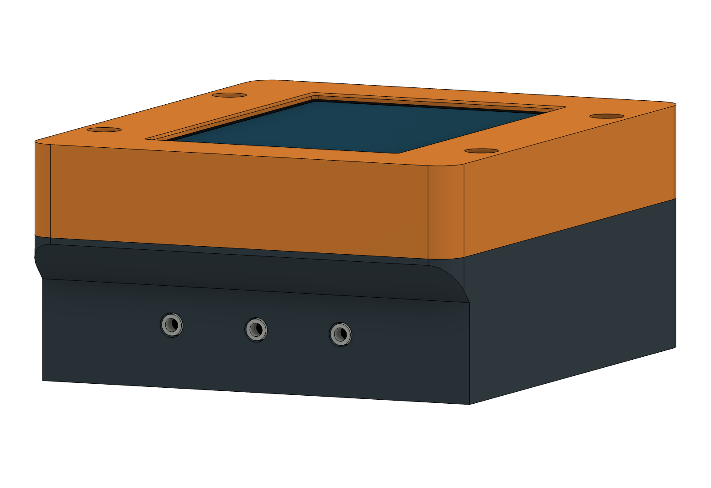

# Stepped probe face — appearance concept

This is a visual study in a separate Fusion document. It does not replace the
current r9 model or authorize a new print. No production STL files were created.

The lower probe face moves inward **7.5 mm**, from Y−52 to Y−44.5. The three
jack mouths meet that face, using small fitted openings instead of deep access
holes. A sloped shoulder rises from Z18.9 to Z26.4 and meets the existing outer
profile beneath the top/bottom seam.

The screen, PCB and retainer remain in their current positions. The upper
housing and overall **104 × 86 × 44.9 mm** envelope remain unchanged; only the
lower probe-end footprint becomes shorter.

[Side profile](stepped-side-profile.png) · [Before](before-probe-face.png) ·
[Isometric concept](stepped-probe-face.png) ·
[Fusion concept archive](stepped-probe-face-CONCEPT.f3d)

The visible outer shape is demonstrated; the probe fascia split/joint and PCB
installation path still need design. Closed openings at both ends cannot use
the old drop-and-slide sequence. Actual plug boot clearance, edge rounding,
print supports and wall strength also remain for the implementation stage.
The concept shows a continuous face to communicate appearance, not a finalized
assembly split.

`render_concept.py` creates the study from the unchanged r9 archive using native
Fusion features and viewport rendering. `concept-notes.json` records its scope.
