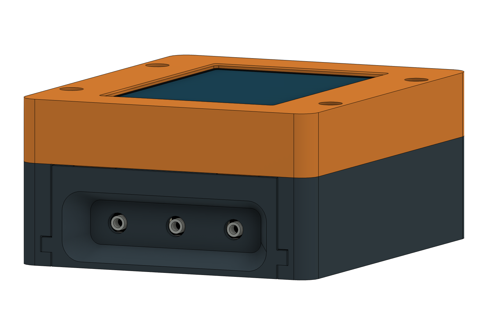
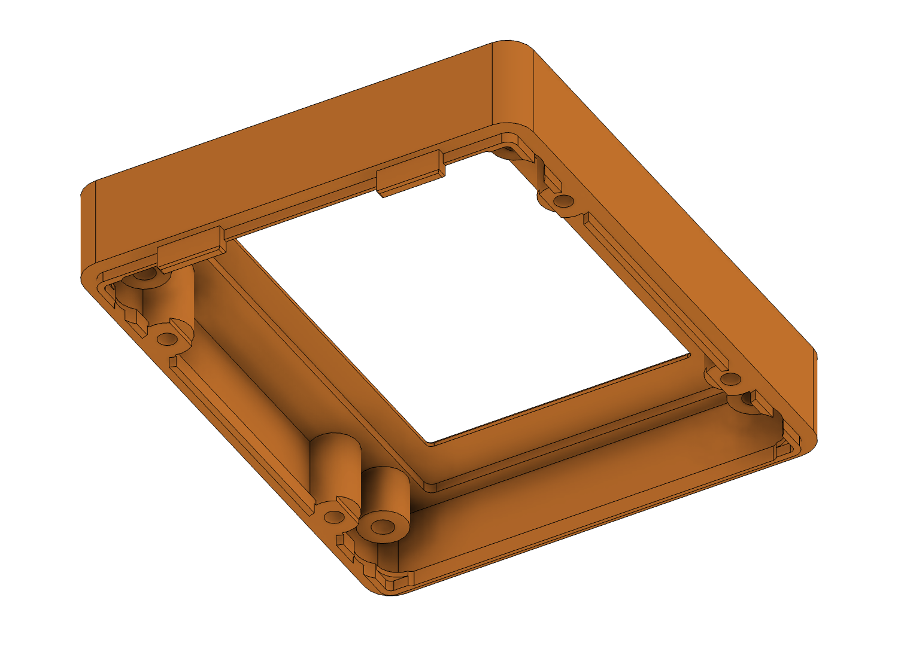
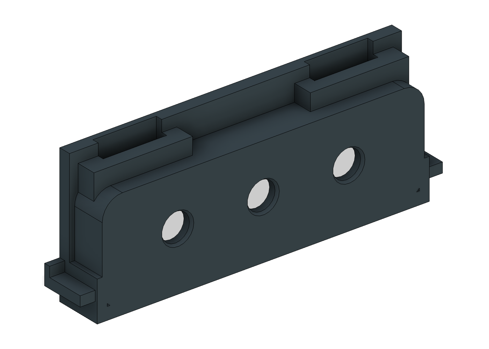
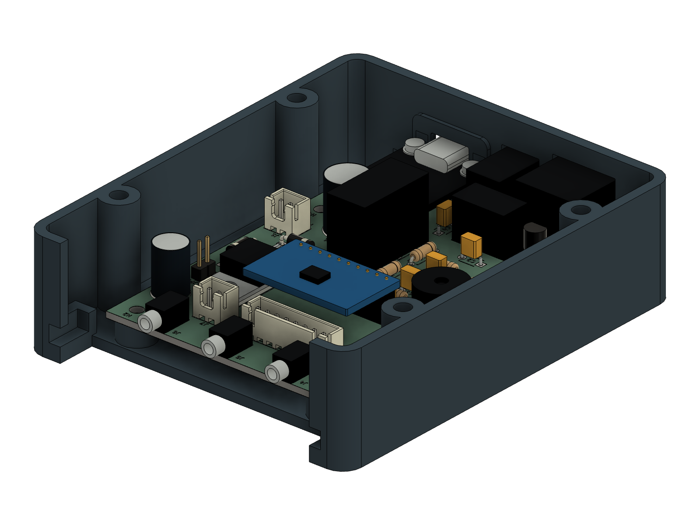
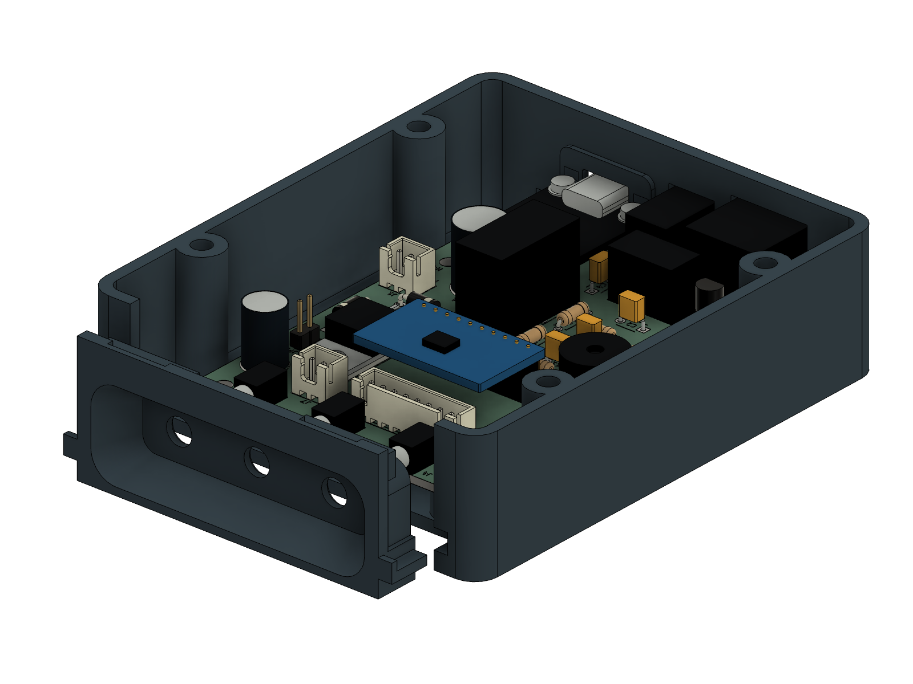
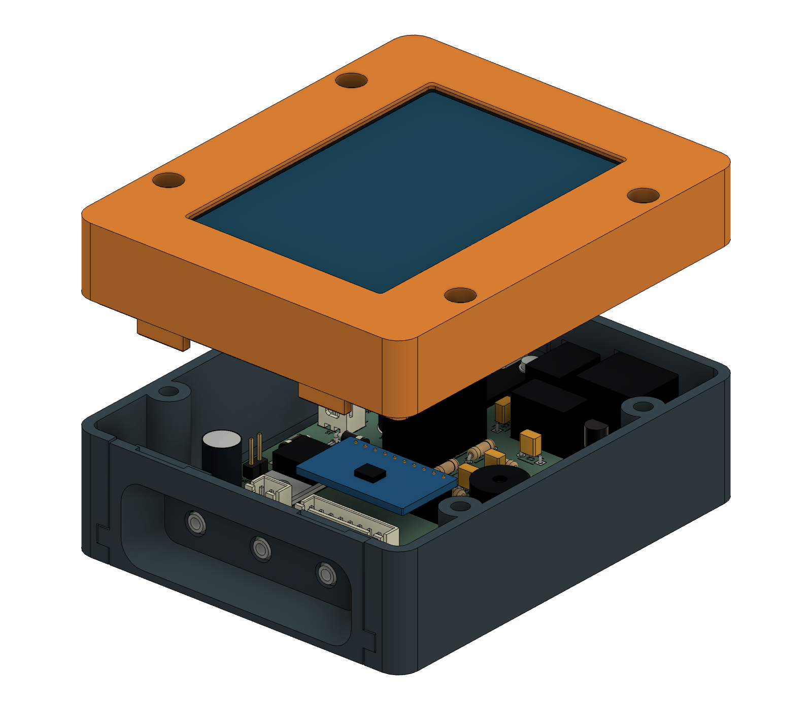

# Reinforced probe enclosure — Fusion r10

The probe panel now slides into the bottom and is retained by two reinforced
keys on the top bezel. The keys are **12 mm wide × 2.1 mm thick**, with 0.4 mm
entry chamfers. Their keepers have 3 mm side arms, a 2.75 mm rear strap and
integrated support webs. This adds no screws or heat-set inserts.

Use all four r10 printed parts together: bottom, top, display retainer and
probe fascia. The outer case remains **104 × 86 × 44.9 mm**. The PCB, screen
position and power connectors are unchanged. The approved rounded probe recess
has 1 mm more clearance at its lower entry for the angled ThermoWorks plugs.

**CAD assembly and mesh checks pass. Physical fit and printed strength still
need a test print.** Start with the joint coupons and the small probe fascia.

## Files

- [Complete model and print package](pitclaw-enclosure-r10.zip).
- [Editable Fusion model](pitclaw-enclosure-r10.f3d), including populated-board
  references and native sketches/features for the enclosure.
- `stl/`: four complete parts and five test pieces, oriented for printing.
- `step/`: the four complete printed parts in assembled coordinates.
- `native-verification.json`, `mesh-verification.json` and
  `reference/fit-verification.json`: geometry and mesh checks.
- `release-manifest.json`: file hashes, protected hardware hashes and checks.

Colors distinguish components in the previews; they do not specify filament.
Only the files in `stl/` are intended for slicing. The PCB, display and hardware
in Fusion are assembly references.
The four complete print meshes are exported from Fusion. The three joint
coupons are cropped from the independently checked reference; the power and
insert coupons are the preserved r9 files.

## What changed at the joint

The keys enter open-top notches as the lid is lowered. They are rigid locating
and retaining features; assembly should not flex them. Clearance is 0.30 mm on
each side across the key width and 0.25 mm in the panel's sliding direction.
The entry chamfer leaves 1.6 mm of full-section retaining-face engagement when
the panel is seated. There is 0.5 mm nominal clearance to the display retainer.

Bottom guides support the fascia and stop its inward motion. The closed lid
limits upward movement to 0.3 mm and prevents outward withdrawal after about
0.25 mm of free play. The thin lower edge of the cable recess is not used as
the retaining feature or as a removal handle.

## Print orientation and starting settings

Import at **100% scale in millimeters**, keeping the supplied orientation.

| File in `stl/` | X × Y × Z, mm | Orientation |
| --- | --- | --- |
| carrier-bottom.stl | 86 × 104 × 27.6 | Floor down, open side up |
| carrier-top.stl | 86 × 104 × 21.9 | Display face down; keys upward |
| carrier-retainer.stl | 80 × 96 × 2.5 | Flat |
| probe-fascia.stl | 72 × 27.3 × 9.5 | Exterior face down |
| joint-coupon-bottom.stl | 33 × 11.5 × 27.6 | Same as bottom |
| joint-coupon-top.stl | 33 × 11.5 × 21.9 | Same as top |
| joint-coupon-fascia.stl | 26 × 27.3 × 9.5 | Same as fascia |
| fit-coupon.stl | 86 × 22 × 27.6 | Corrected power-end coupon, floor down |
| insert-coupon.stl | 36 × 16 × 7.5 | Flat |

For the 0.4 mm nozzle, use 0.20 mm layers, four perimeters, five top/bottom
solid layers and 25% infill as starting settings. Use the filament maker's
temperature, cooling and bed profile. Inspect the actual toolpaths through the
keys, keeper arms and thin walls; a requested perimeter count does not guarantee
that count fits everywhere. [Prusa's modeling guidance](https://help.prusa3d.com/article/modeling-with-3d-printing-in-mind_164135).

The fascia prints with its outside on the bed. It has a roughly 12 mm bridge
across the pocket floor and a **12.6 mm bridge across each keeper notch**.
Check bridge direction and sag in the slicer. If local support is needed under
the notch straps, make it removable through their open upper ends; a
build-plate-only support setting may miss these bridges over existing material.
Clear supports and strings from the notches and plug seating surfaces before
assembly. Also inspect the existing power-port roofs and screw recesses.

Use the same material and settings for coupons and full parts. PETG needs
particular attention to bridges and support removal; see the
[Prusa PETG guide](https://help.prusa3d.com/article/petg_2059). HT-PLA behavior
depends on the actual formulation. If its maker calls for heat treatment, apply
that process to the coupons and recheck dimensions afterward; treatment can
change dimensions differently by axis. [Manufacturer example](https://proto-pasta.com/blogs/how-to/heat-treating-carbon-fiber-htpla-for-accurate-heat-resistant-parts).
No heat-resistance or service-life rating is established for this enclosure.

## Use the coupons first

Print the three `joint-coupon-*` pieces. They contain one complete keeper, its
matching bezel key and the bottom guide. Slide the fascia fragment along its
guide to the stop, then lower the top fragment so the key enters freely. Hold
the top against the bottom by hand and check that the fascia cannot withdraw
beyond its small clearance. Lift the top and check that the fascia releases.
Repeat assembly and inspect for cracking, whitening, loose layers or binding.
This small hand-held sample does not reproduce full-case loading or screw clamp.

Print the complete `probe-fascia.stl` to test the actual three ThermoWorks
Pro-Series plugs together against the installed jacks. Confirm full insertion
and cable clearance with the angled cables pointing toward the case bottom,
including the panel's approximately 0.25 mm outward play. The extra lower-entry
clearance was based on the supplied ruler photo, not a measured 3D plug model.

The power-end and insert coupons are unchanged copies of the corrected r9
files. Use the power coupon with the real USB, barrel and RJ45 connectors;
support the board rather than hanging it from the connectors. The insert coupon
provides 4.0/4.1/4.2 mm trial pilots. The enclosure uses 4.0 mm pilots for short
M3 inserts. If another pilot is needed, change the CAD and regenerate those
parts; do not scale the whole enclosure to adjust one fit.

## Hardware

| Quantity | Item | Location |
| --- | --- | --- |
| 12 | Short M3 inserts, nominal Ø4.6 × 4 mm | Four carrier, four closure, four retainer anchors |
| 4 | M3 × 6 screws with 0.5 mm insulating washers | Carrier mounts; washer OD ≤7 mm |
| 4 | M3 × 18 screws | Case closure; head OD ≤6 mm, height ≤3 mm |
| 4 | M3 × 6 button-head screws | Display retainer anchors |
| 4 | Small screws matched to the WT32 rear blind bosses | WT32 to retainer; verify thread and engagement |
| 1 | Compliant strip on the inactive glass border | Provisional compressed thickness 0.3 mm |
| 2 sets | Existing M2 screws, washers and nuts with 3 mm spacers | USB module mounting |

The USB hardware must stay within the reviewed Ø5 mm envelope, with no more
than 2 mm above the module and 3.3 mm below the carrier. Keep the existing
insulating support under the USB module's free end. Verify actual screw lengths
and display-pad preload before tightening. The fascia needs no added hardware.

## Assembly

1. Remove support and first-layer burrs. Check the empty plastic parts, then
   install the inserts before fitting electronics. Prepare the USB module and
   keep solder tails within the reviewed 3 mm projection below the carrier.
2. Leave the top and fascia off. Start the populated carrier **4 mm toward the
   probe end** from its final location. Lower it to **0.3 mm above the mounting
   posts**, slide it 4 mm toward the power connectors, then lower and fasten it
   using the four carrier screws and insulating washers.

3. Slide the fascia straight inward from the probe end, over all three jack
   noses, until its runners meet their stops. It should seat without pushing
   on the PCB or bending the jacks.

4. Attach the display retainer to the WT32's rear blind bosses. Fit the display
   and compliant border strip inside the top, then fasten the retainer to the
   four top anchors. Hard stops establish its position. Connect and route the
   harness clear of the seam, keys and components.
5. Hold the fascia against its stops and lower the top vertically. The keys
   enter before the main locating lip fully aligns the shells, so guide both
   sides together. If it binds, lift and realign it. Once the seam seats by hand,
   tighten the four closure screws gently; do not use them to force alignment.

For service, unplug external cables and remove the top. Pull the fascia
**straight outward until its rear plate clears the jack noses before lifting**.
Its open-top guides allow lifting early, but doing so would lever against the
soldered jacks. Grip the sturdy side areas, not the thin lower recess edge.
Only then unfasten and reverse-slide the carrier toward the probe end.

## Verification and limits

The independent reference passes 24 modeled geometry scenarios: carrier and
fascia insertion, lid closure, display-retainer insertion, declared board/module
tolerances, and the approach to maximum fascia lift. Seven reference meshes
pass watertightness, winding, connected-solid and print-size checks.

Native Fusion checks 131 potentially overlapping component/case body pairs,
with no positive-volume clashes or feature-health issues. Deliberately moving
the fascia outward 0.5 mm, inward 0.5 mm or upward 1 mm produces blocking
intersections, verifying that the tested assembly has real retaining stops.
The permitted 0.2999 mm upward position stays clear; the 0.0001 mm numerical
margin avoids counting intended contact at the exact 0.3 mm stop.

The four native print meshes are compared with the independent reference using
bidirectional surface samples and a 0.03 mm allowance for curved-surface
tessellation. These checks establish modeled assembly and exported geometry.
They do not establish printed joint strength, all purchased-part tolerances,
wire routing, thermal performance, sealing or long-term durability.
