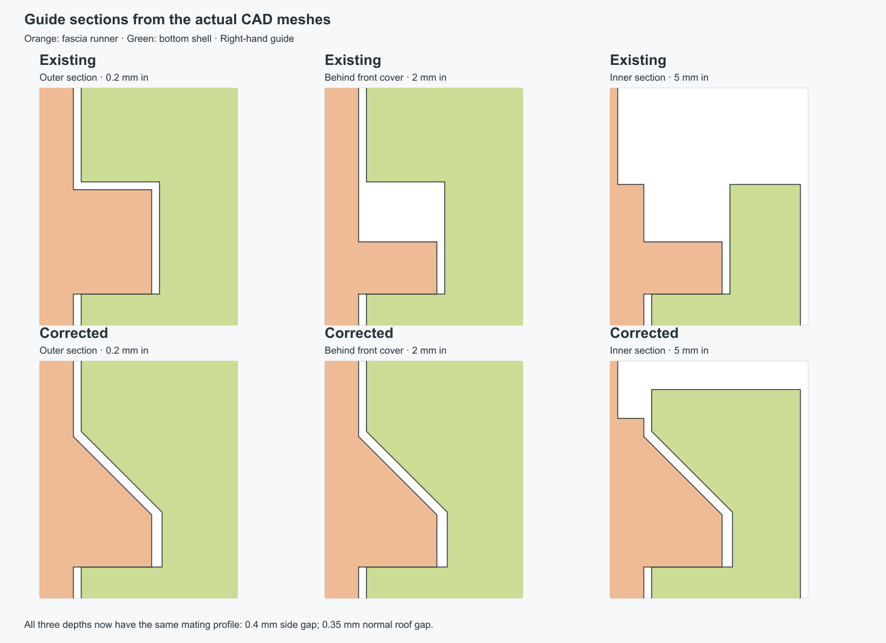
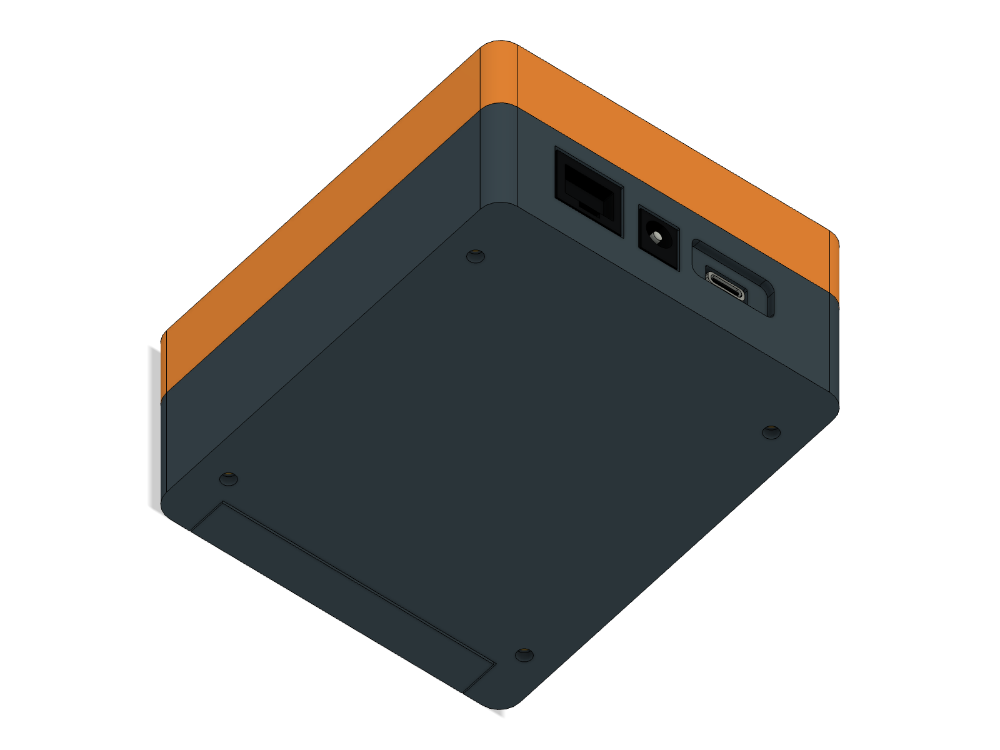
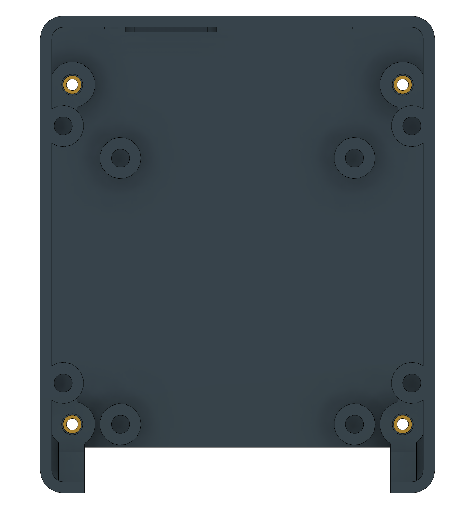
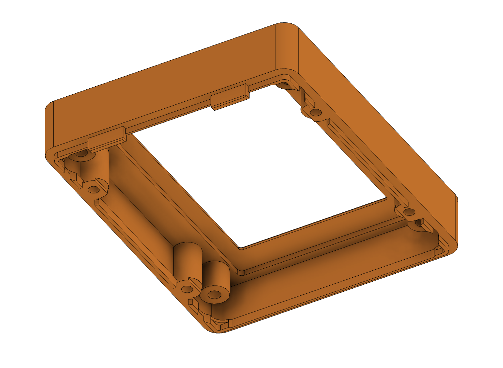
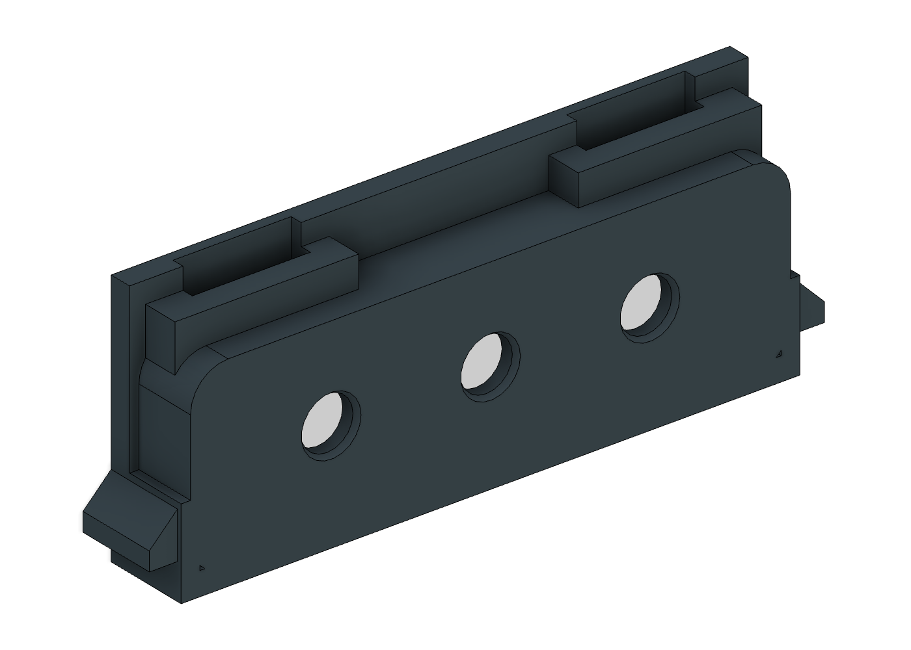
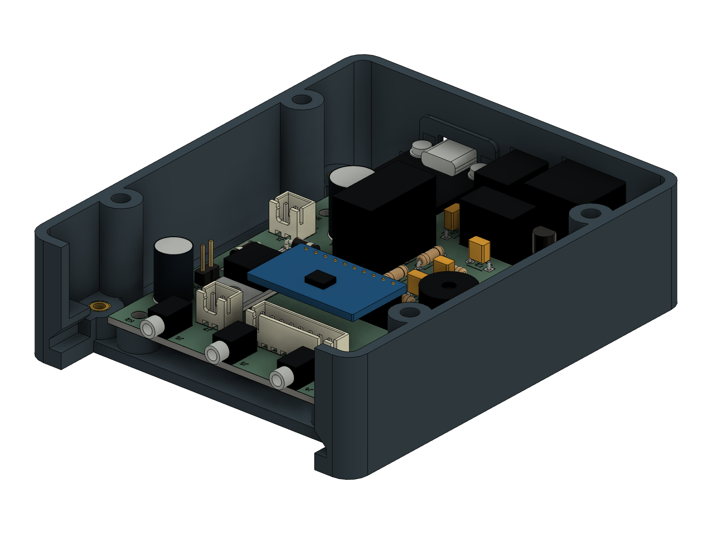
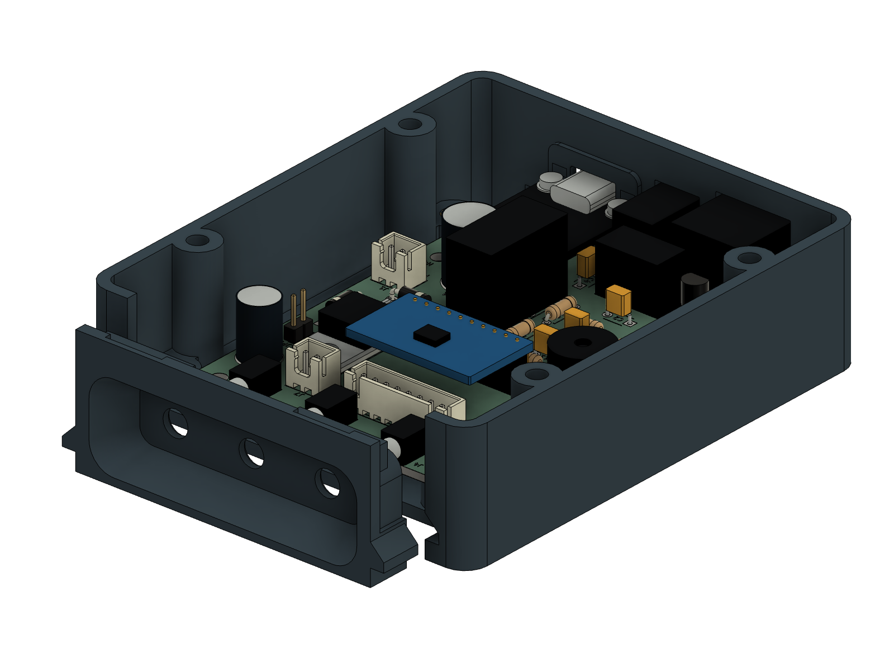
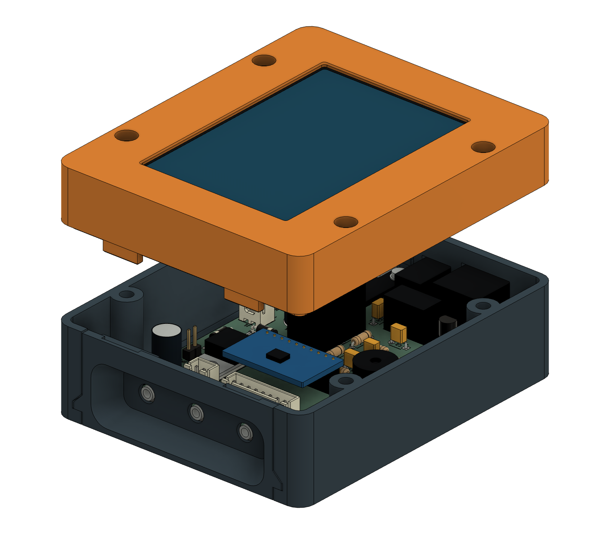

# Enclosure with continuous fascia guides — Fusion r12

R12 corrects the fascia's guide geometry: the runner and its retaining groove
now have a consistent cross-section over the full **9 mm engagement depth**.
The previous guide fitted closely only at its outer end and left a large gap
farther inside. This was a CAD mismatch; the correction changes both mating
parts. **Use the new bottom and fascia together.** The top and display retainer
are unchanged and can be reused.

The case retains **four M3 mounting inserts inside the bottom shell**, on a
**72 × 74 mm rectangular pattern**. Future brackets screw in from underneath.
Install the inserts before the electronics so attaching a mount later will not
require opening the case. The outer bottom stays flat, with four Ø3.4 mm access
holes and no projecting bosses.

The full package includes all four current parts. The PCB, connector
positions, reinforced bezel keys and **104 × 86 × 44.9 mm** case size are unchanged.

**CAD and mesh checks pass; physical fit and mounting strength still need a test
print.** Use the new mounting coupon to check your inserts and screw engagement.

## Files

- [Complete Fusion model and print package](pitclaw-enclosure-r12.zip).
- [Editable Fusion model](pitclaw-enclosure-r12.f3d).
- [Mounting hole coordinates](mount-interface.json) and
  [DXF mounting-hole layout](mount-pattern.dxf), in millimeters.
- `stl/`: four complete parts and six coupons, all oriented for printing.
- `step/`: the four complete parts in assembled coordinates.
- [Mount design review](mount-review.md) and the JSON verification reports.
- [Guide correction review](guide-review.md) and
  [measured reference sections](reference/guide-section-verification.json).

The four complete print meshes come from Fusion; the six coupon meshes come
from the independently checked reference. Power and joint-bottom coupons were
regenerated to include the current mounting geometry. The insert-size
calibration block provides pilot-size trials. The brass-colored inserts
in Fusion are simplified references, not printable components.

## Editing and regenerating the release

The included F3D archive is the editable CAD source, with its native feature
history and populated-board references. Open it in Fusion, edit the current
design, then run `export_r12.py` through the Fusion Python API to export parts
and previews. The old upgrade scripts and earlier enclosure archives are no
longer required or kept in the working tree.

In the repository, the self-contained `reference/carrier-case.scad` and its generated
`carrier-interface.scad` provide the independent assembly model. Run
`reference/verify_reference.py` with OpenSCAD and Python/trimesh to check the
reference, then `verify_exports.py` to compare the native meshes. Finally run
`package_release.py` to check the current files and assemble the ZIP. These
tools require only the current enclosure and the protected carrier hardware.

When the PCB changes, `hardware/carrier-revb/tools/export_enclosure_interface.py`
updates the interface directly in this reference directory. Recheck both CAD
models and regenerate their exports after interface or geometry changes.

## Bottom mounting interface

| Feature | Dimension |
| --- | --- |
| Thread | M3, four places |
| Hole centres from case centre | X = ±36 mm, Y = ±37 mm |
| Hole pitch across / along case | 72 / 74 mm |
| Boss outside diameter | 10 mm |
| Boss top above the outer bottom | 7.5 mm |
| Inside insert pilot | Ø4 mm, 5 mm deep |
| External screw clearance | Ø3.4 mm through the 2.5 mm floor |
| Insert | Short M3, 4 mm long; nominal maximum OD 4.6 mm |
| Recommended screw protrusion into case | 6.5–7.0 mm |

The bosses connect to the floor, side walls and case-closure posts. The hole
pattern is a custom accessory interface; no external mounting standard or
specific bracket is assumed.

Fit four additional [Ruthex RX-M3S×4.0 inserts](https://www.ruthex.de/products/ruthex-gewindeeinsatz-m3s-100stuck-rx-m3x4-0-short-messing-gewindebuchsen-fur-3d-druck)
from inside, flush with the boss tops, before installing electronics. This
brings the total to **16 inserts** when all four mounting points are fitted.
The existing fascia retention still needs no extra fasteners.

Tool access was checked with a straight **Ø8 mm working section** from the boss
top to 35 mm above the exterior bottom. Keep a larger iron barrel above that
height. Two small internal guide ledges were lowered by 0.5 mm for this access;
the probe-panel guide stops remain functional. Match the actual tool nose and
follow the insert maker's heat-setting process.

With a 4 mm insert flush at Z7.5, its lower end is at Z3.5. A screw that protrudes
**6.5–7 mm beyond the bracket's case-contact face** gives approximately 3–3.5 mm
engagement. Account for bracket and washer thickness when choosing the screw:
for example, a nominal M3×10 screw through a 3 mm bracket gives 7 mm protrusion
before tolerances. Verify actual protrusion; do not exceed 7.5 mm into the case.
Use a flat mating surface around the holes and tighten gently.

The 1 mm space beneath each insert allows melt relief. The smaller floor hole
provides secondary capture if an insert moves outward; the heat-set bond,
reinforced boss and wall connections carry the initial load. This is a mounting
provision for the controller, not a measured pull-out or cantilever-load rating.

Print `mount-coupon.stl` first, fit one insert from inside, then try the screw
from underneath with your intended bracket/washer stack. Check entry, engagement,
insert rotation, cracking and floor distortion. The 10 mm-high coupon does not
reproduce the full shell wall height, so verify the actual iron reaches the
full shell before heating it.

## What changed at the joint

The keys enter open-top notches as the lid is lowered. They are rigid locating
and retaining features; assembly should not flex them. Clearance is 0.30 mm on
each side across the key width and 0.25 mm in the panel's sliding direction.
The entry chamfer leaves 1.6 mm of full-section retaining-face engagement when
the panel is seated. There is 0.5 mm nominal clearance to the display retainer.

The lower rails use matching 45° upper faces through their entire length,
with **0.4 mm outer-side clearance** and **0.354 mm clearance measured normal
to the sloped roof**. Their supporting floor stays at Z3.8 and rear stops at
Y−43, preserving the jack alignment. The roof has at least 1.6 mm of material
at its inner edge. These clearances are constant with depth; there is no
separate tall cover at the front or open guide section behind it.

The bottom guides support the fascia, restrain upward movement and stop its
inward motion. The closed lid
limits upward movement to 0.3 mm and prevents outward withdrawal after about
0.25 mm of free play. The thin lower edge of the cable recess is not used as
the retaining feature or as a removal handle.

## Print orientation and starting settings

Import at **100% scale in millimeters**, keeping the supplied orientation.

| File in `stl/` | X × Y × Z, mm | Orientation |
| --- | --- | --- |
| carrier-bottom.stl | 86 × 104 × 27.6 | Floor down, open side up |
| carrier-top.stl | 86 × 104 × 21.9 | Display face down; keys upward |
| carrier-retainer.stl | 80 × 96 × 2.5 | Flat |
| probe-fascia.stl | 72 × 27.3 × 9.5 | Exterior face down |
| joint-coupon-bottom.stl | 33 × 11.5 × 27.6 | Same as bottom |
| joint-coupon-top.stl | 33 × 11.5 × 21.9 | Same as top |
| joint-coupon-fascia.stl | 26 × 27.3 × 9.5 | Same as fascia |
| fit-coupon.stl | 86 × 22 × 27.6 | Corrected power-end coupon, floor down |
| insert-coupon.stl | 36 × 16 × 7.5 | Flat |
| mount-coupon.stl | 16 × 21 × 10 | Floor down |

For the 0.4 mm nozzle, use 0.20 mm layers, four perimeters, five top/bottom
solid layers and 25% infill as starting settings. Use the filament maker's
temperature, cooling and bed profile. Inspect the actual toolpaths through the
keys, keeper arms and thin walls; a requested perimeter count does not guarantee
that count fits everywhere. [Prusa's modeling guidance](https://help.prusa3d.com/article/modeling-with-3d-printing-in-mind_164135).

The fascia prints with its outside on the bed. It has a roughly 12 mm bridge
across the pocket floor and a **12.6 mm bridge across each keeper notch**.
Check bridge direction and sag in the slicer. If local support is needed under
the notch straps, make it removable through their open upper ends; a
build-plate-only support setting may miss these bridges over existing material.
Clear supports and strings from the notches and plug seating surfaces before
assembly. Also inspect the existing power-port roofs and screw recesses.

Use the same material and settings for coupons and full parts. PETG needs
particular attention to bridges and support removal; see the
[Prusa PETG guide](https://help.prusa3d.com/article/petg_2059). HT-PLA behavior
depends on the actual formulation. If its maker calls for heat treatment, apply
that process to the coupons and recheck dimensions afterward; treatment can
change dimensions differently by axis. [Manufacturer example](https://proto-pasta.com/blogs/how-to/heat-treating-carbon-fiber-htpla-for-accurate-heat-resistant-parts).
No heat-resistance or service-life rating is established for this enclosure.

## Use the coupons first

Print the three `joint-coupon-*` pieces. They contain one complete keeper, its
matching bezel key and the bottom guide. Slide the fascia fragment along its
guide to the stop, then lower the top fragment so the key enters freely. Hold
the top against the bottom by hand and check that the fascia cannot withdraw
beyond its small clearance. Lift the top and check that the fascia releases.
With the top fragment removed, also check that the fully inserted rail is
captured at its inner end and cannot simply lift out. Repeat assembly and
inspect for cracking, whitening, loose layers or binding.
This small hand-held sample does not reproduce full-case loading or screw clamp.

Print the complete `probe-fascia.stl` to test the actual three ThermoWorks
Pro-Series plugs together against the installed jacks. Confirm full insertion
and cable clearance with the angled cables pointing toward the case bottom,
including the panel's approximately 0.25 mm outward play. The extra lower-entry
clearance was based on the supplied ruler photo, not a measured 3D plug model.

The power-end coupon is regenerated from this bottom; the insert calibration
geometry is unchanged. Use the power coupon with the real USB, barrel and RJ45 connectors;
support the board rather than hanging it from the connectors. The insert coupon
provides 4.0/4.1/4.2 mm trial pilots. The enclosure uses 4.0 mm pilots for short
M3 inserts. If another pilot is needed, change the CAD and regenerate those
parts; do not scale the whole enclosure to adjust one fit.

## Hardware

| Quantity | Item | Location |
| --- | --- | --- |
| 16 | Short M3 inserts, nominal Ø4.6 × 4 mm | Four carrier, four closure, four retainer, four future-mount anchors |
| 4 | M3 × 6 screws with 0.5 mm insulating washers | Carrier mounts; washer OD ≤7 mm |
| 4 | M3 × 18 screws | Case closure; head OD ≤6 mm, height ≤3 mm |
| 4 | M3 × 6 button-head screws | Display retainer anchors |
| 4 | Small screws matched to the WT32 rear blind bosses | WT32 to retainer; verify thread and engagement |
| 1 | Compliant strip on the inactive glass border | Provisional compressed thickness 0.3 mm |
| 2 sets | Existing M2 screws, washers and nuts with 3 mm spacers | USB module mounting |

The USB hardware must stay within the reviewed Ø5 mm envelope, with no more
than 2 mm above the module and 3.3 mm below the carrier. Keep the existing
insulating support under the USB module's free end. Verify actual screw lengths
and display-pad preload before tightening. The fascia needs no added hardware.

## Assembly

1. Remove support and first-layer burrs. Check the empty plastic parts, then
   install the case and four new mounting inserts before fitting electronics. Prepare the USB module and
   keep solder tails within the reviewed 3 mm projection below the carrier.
2. Leave the top and fascia off. Start the populated carrier **4 mm toward the
   probe end** from its final location. Lower it to **0.3 mm above the mounting
   posts**, slide it 4 mm toward the power connectors, then lower and fasten it
   using the four carrier screws and insulating washers.

3. Slide the fascia straight inward from the probe end, over all three jack
   noses, until its runners meet their stops. It should seat without pushing
   on the PCB or bending the jacks.

4. Attach the display retainer to the WT32's rear blind bosses. Fit the display
   and compliant border strip inside the top, then fasten the retainer to the
   four top anchors. Hard stops establish its position. Connect and route the
   harness clear of the seam, keys and components.
5. Hold the fascia against its stops and lower the top vertically. The keys
   enter before the main locating lip fully aligns the shells, so guide both
   sides together. If it binds, lift and realign it. Once the seam seats by hand,
   tighten the four closure screws gently; do not use them to force alignment.

For service, unplug external cables and remove the top. Pull the fascia
**straight outward until both rails and the jack noses are clear before lifting**.
The continuous guide roofs retain the rails during withdrawal. Grip the sturdy
side areas, not the thin lower recess edge.
Only then unfasten and reverse-slide the carrier toward the probe end.

## Verification and limits

The independent reference passes 31 modeled geometry scenarios: carrier and
fascia insertion, lid closure, display-retainer insertion, declared board/module
tolerances, the approach to maximum fascia lift, external screw shafts and
interior heat-setting tool access, plus five checks for capture at different
depths of both rails without the lid. Ten reference meshes
pass watertightness, winding, connected-solid and print-size checks.

Native Fusion checks 131 potentially overlapping component/case body pairs,
with no positive-volume clashes or feature-health issues. Deliberately moving
the fascia outward 0.5 mm, inward 0.5 mm or upward 1 mm produces blocking
intersections, verifying that the tested assembly has real retaining stops.
The permitted 0.2999 mm upward position stays clear; the 0.0001 mm numerical
margin avoids counting intended contact at the exact 0.3 mm stop.

Native guide checks also inspect five depths on each side: the nominal fit and
0.3 mm upward movement remain clear, while 0.7 mm upward movement is blocked by
the guide roof at every position. Section measurements confirm the outer and
inner mating profiles agree. Earlier no-clash checks alone did not detect the
missing inner restraint; these added checks address that omission.

The four mount screw paths and Ø8 mm tool-access paths pass separate native
checks. Simplified inserts clear the electronics and other shell components.
Their intentional interference with the heat-set pilots is excluded; displaced
insert tests verify the secondary floor shoulder blocks outward passage.

The four native print meshes are compared with the independent reference using
bidirectional surface samples and a 0.03 mm allowance for curved-surface
tessellation. These checks establish modeled assembly and exported geometry.
They do not establish printed joint strength, all purchased-part tolerances,
wire routing, thermal performance, sealing or long-term durability.
