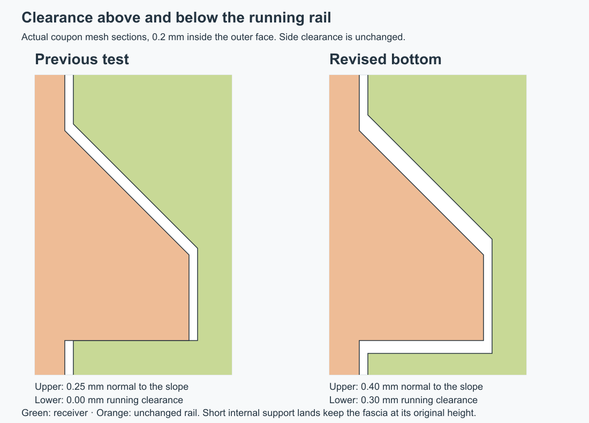

# Clamped enclosure-fit test

This second test adjustment adds room above and below the guide following the
reported tight fit. **Reprint only `bottom.stl`** if you already printed the
first fit-test set: its `top.stl` and `fascia.stl` are unchanged.

The guide's side clearance stays at 0.20 mm. Its sloping upper gap increases to
0.40 mm measured normal to the face. The underside receives 0.30 mm running
clearance, with two short, ramped support lands left at the original height so
the fascia remains level and the probe holes retain their nominal position.

It includes the case's real closure screw and tall insert post, so the
top/bottom seam can be checked with the same clamping arrangement as the case.
The released R12 Fusion model and full-case print files are unchanged pending
this physical fit check.

## What the adjusted sample changes

| Interface | First fit-test set | Revised sample |
| --- | ---: | ---: |
| Top/bottom closure plane | 0 mm gap | 0 mm gap |
| Fascia side and top edges | 0.20 mm | 0.20 mm |
| Fascia rear floor joint | 0.20 mm | 0.20 mm |
| Guide outer-side clearance | 0.20 mm | 0.20 mm |
| Clearance normal to the sloping guide roof | 0.25 mm | 0.40 mm |
| Clearance below the rail's running areas | 0 mm | 0.30 mm |
| Locating-lip corner clearance | 0.30 mm | 0.30 mm |

These are CAD dimensions, not measurements extracted from the photograph.
The support lands remain at Z3.8, the stop at Y−43, the probe seating face at
Y−44.5 and the probe axes at Z11.65. The fascia is not shifted relative to the
jacks. Lowering the whole channel without keeping support lands would allow
it to drop or tilt; instead, the lands are separated along the guide and have
short ramps for entering and leaving them.

The 0.30 mm lower clearance applies between the support lands. The lands are
intentional seating contacts, not another clearance that should be enlarged.

The front land raises the rail to its original height early in insertion,
before the probe collars enter the fascia holes. The rear land then provides
a second support, approximately 6.1 mm away, to control pitching.

## Parts in the test kit

- `bottom.stl`: revised receiver with upper/lower relief and actual tall closure post.
- `top.stl`: reuse the matching top fragment with the existing screw recess and corrected
  locating-lip corner.
- `fascia.stl`: unchanged from the first fit-test set.

Keep the supplied print orientations and use millimeters at 100% scale. Use the
same printer, material and profile as the photographed parts. The bottom and
top footprints are 33 × 30 mm. The fascia is 26 × 27.4 × 9.8 mm in its supplied
print orientation. These are test fragments, not complete enclosure parts.

Use **one short M3 × 4 mm heat-set insert** and **one M3 × 18 mm closure screw**.
Install the insert in the **tall closure post**, whose top reaches the shell
seam. Leave the nearby low accessory-mount boss empty for this test. The screw
passes through the top fragment and enters the tall post from above.

## Check the three interfaces in order

1. Fit the top and bottom **without the fascia**. Align their flat cut ends and
   check that the seam seats by hand. Lightly snug the screw to hold that
   position. It must not be used to pull a binding joint into alignment.
2. Remove the top. Slide the fascia into its guide until it reaches the stop.
   Check whether it moves smoothly and sits level with the surrounding face.
3. Refit the top with its key in the keeper, align the cut ends, then lightly
   snug the screw. Compare the top/bottom seam with step 1 and inspect the
   bottom/fascia seam and guide fit.

If the top closes without the fascia but stands off with it installed, the
fascia/guide/key fit needs more room. If it stands off in both cases, investigate
the shell lip and closure surfaces first. This separates the three interfaces
instead of tightening every clearance at once.

## Optional control pair

`control-bottom.stl` and `control-top.stl` use the original R12 clearances but
include the same real closure screw. Use the R12 fascia coupon already printed
with these control parts. They help distinguish a change caused by the adjusted
fit from the effect of holding the joint closed with its intended fastener.

The trial can establish local seating and fit on the actual printer. It does
not establish a structural load rating or the warping of the complete case.

The revised candidate is checked for nominal closure, the lower starting
position and ramp-up path, and support at both lands. All five coupon meshes
are single watertight solids; all 37 geometry checks pass. The released Fusion
model, reference and production meshes were checked unchanged, as were the
test kit's top, fascia and both control meshes.
Sources and the regeneration/verification scripts are kept in this repository's
`fit-test/` directory; the ZIP contains the printable test kit and its records.
