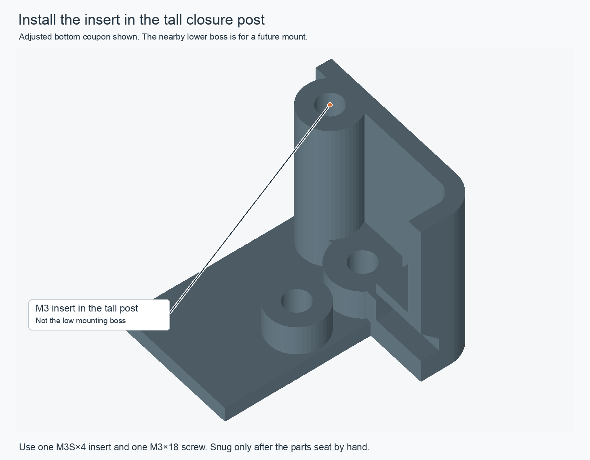

# Clamped enclosure-fit test

This adjusted test joint targets the visible fascia gaps and the guide fit.
It includes the case's real closure screw and tall insert post, so the
top/bottom seam can be checked with the same clamping arrangement as the case.
The released R12 Fusion model and full-case print files are unchanged pending
this physical fit check.

## What the adjusted sample changes

| Interface | Current R12 | Adjusted sample |
| --- | ---: | ---: |
| Top/bottom closure plane | 0 mm gap | 0 mm gap |
| Fascia side and top edges | 0.30 mm | 0.20 mm |
| Fascia rear floor joint | 0.50 mm | 0.20 mm |
| Guide outer-side clearance | 0.40 mm | 0.20 mm |
| Clearance normal to the sloping guide roof | 0.354 mm | 0.25 mm |
| Locating-lip corner clearance | About 0.217 mm | 0.30 mm, matching the straight sides |

These are CAD dimensions, not measurements extracted from the photograph.
The runner bearing remains at Z3.8, its stop at Y−43, the probe seating face at
Y−44.5 and the probe axes at Z11.65. The fascia edges are extended to reduce the
seams; the fascia is not shifted relative to the jacks. Its keeper notches also
extend through the raised upper edge so the bezel keys cannot hit a thin cap.

## Print these three parts first

- `bottom.stl`: adjusted receiver and actual tall closure post.
- `top.stl`: matching top fragment with the existing screw recess and corrected
  locating-lip corner.
- `fascia.stl`: adjusted fascia edge/floor clearances, with the same runner and
  probe-seat datums.

Keep the supplied print orientations and use millimeters at 100% scale. Use the
same printer, material and profile as the photographed parts. The bottom and
top footprints are 33 × 30 mm. The fascia is 26 × 27.4 × 9.8 mm in its supplied
print orientation. These are test fragments, not complete enclosure parts.

Use **one short M3 × 4 mm heat-set insert** and **one M3 × 18 mm closure screw**.
Install the insert in the **tall closure post**, whose top reaches the shell
seam. Leave the nearby low accessory-mount boss empty for this test. The screw
passes through the top fragment and enters the tall post from above.

## Check the three interfaces in order

1. Fit the top and bottom **without the fascia**. Align their flat cut ends and
   check that the seam seats by hand. Lightly snug the screw to hold that
   position. It must not be used to pull a binding joint into alignment.
2. Remove the top. Slide the fascia into its guide until it reaches the stop.
   Check whether it moves smoothly and sits level with the surrounding face.
3. Refit the top with its key in the keeper, align the cut ends, then lightly
   snug the screw. Compare the top/bottom seam with step 1 and inspect the
   bottom/fascia seam and guide fit.

If the top closes without the fascia but stands off with it installed, the
fascia/guide/key fit needs more room. If it stands off in both cases, investigate
the shell lip and closure surfaces first. This separates the three interfaces
instead of tightening every clearance at once.

## Optional control pair

`control-bottom.stl` and `control-top.stl` use the original R12 clearances but
include the same real closure screw. Use the R12 fascia coupon already printed
with these control parts. They help distinguish a change caused by the adjusted
fit from the effect of holding the joint closed with its intended fastener.

The trial can establish local seating and fit on the actual printer. It does
not establish a structural load rating or the warping of the complete case.

The candidate passed 32 modeled geometry checks, including closure without and
with the fascia. All five coupon meshes are single watertight solids. The
released Fusion model, reference and production meshes were checked unchanged.
Sources and the regeneration/verification scripts are kept in this repository's
`fit-test/` directory; the ZIP contains the printable test kit and its records.
