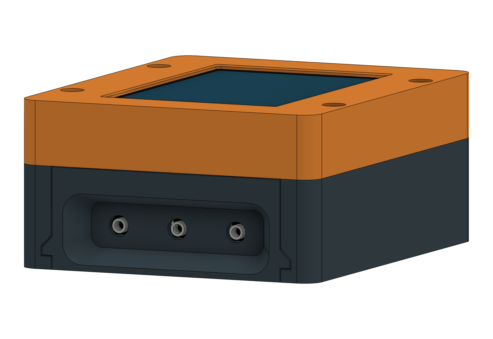
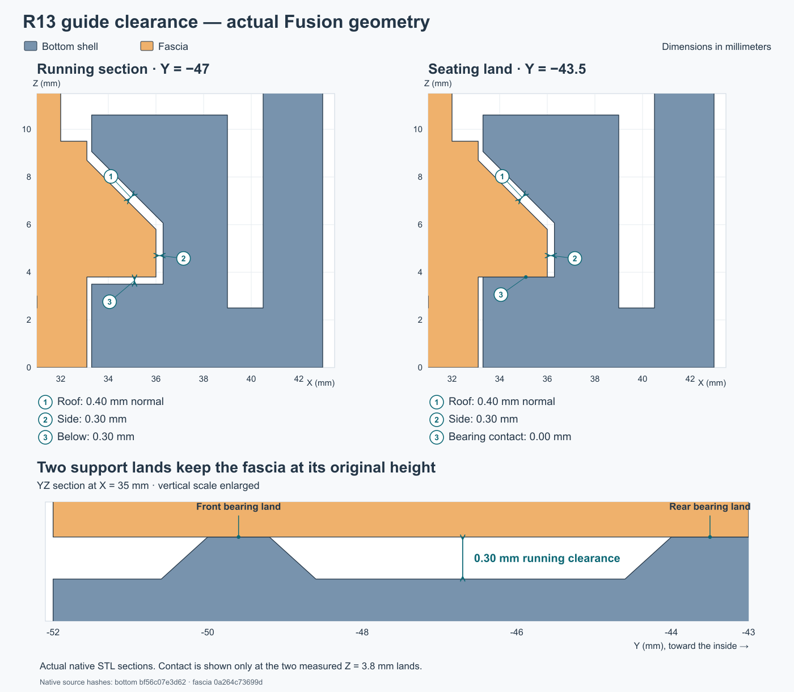
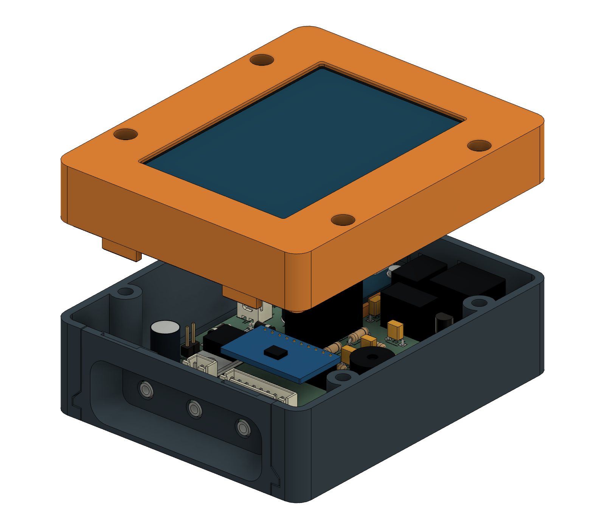

# Complete enclosure — Fusion r13

R13 includes the **complete enclosure**—bottom, top, removable probe fascia and
internal display retainer—plus a printed Adafruit 5807 base. The overall case
remains **104 × 86 × 44.9 mm**. PCB, screen, connector positions and the
72 × 74 mm accessory-mount pattern are unchanged.

The user has confirmed the existing R13 case fit. **Its four enclosure parts
have unchanged geometry and do not need reprinting.** Print only the new USB
base if the case is already made. The base's physical fit still needs checking.



## Files

- [Complete Fusion model](pitclaw-enclosure-r13.f3d)
- [Enclosure and print package](pitclaw-enclosure-r13.zip)
- `step/`: five complete part exports.
- `stl/`: five complete parts and six coupons: **11 STLs**, oriented for printing.
- [Adafruit 5807 base and installation](usb-base/README.md)
- [Guide review](guide-review.md) · [Mount review](mount-review.md)
- [Mount dimensions](mount-interface.json) · [Mount-hole drawing](mount-pattern.dxf)

The five complete print meshes come from Fusion. Coupon meshes come from the
independent reference. Electronics shown in Fusion are reference geometry.

| STL | Size, mm | Orientation |
|---|---|---|
| [carrier-bottom.stl](stl/carrier-bottom.stl) | 86 × 104 × 27.6 | Floor down |
| [carrier-top.stl](stl/carrier-top.stl) | 86 × 104 × 21.9 | Display face down |
| [carrier-retainer.stl](stl/carrier-retainer.stl) | 80 × 96 × 2.5 | Flat |
| [probe-fascia.stl](stl/probe-fascia.stl) | 72 × 27.4 × 9.8 | Outside probe face down |
| [adafruit5807-base.stl](stl/adafruit5807-base.stl) | 23.32 × 24.995 × 4.2 | Flat floor down; no supports |
| joint-coupon-bottom.stl | 33 × 30 × 27.6 | Floor down |
| joint-coupon-top.stl | 33 × 30 × 21.9 | Display face down |
| joint-coupon-fascia.stl | 26 × 27.4 × 9.8 | Outside probe face down |
| fit-coupon.stl | 86 × 22 × 27.6 | Floor down; power-end section |
| insert-coupon.stl | 36 × 16 × 7.5 | Flat; 4.0/4.1/4.2 mm pilot trials |
| mount-coupon.stl | 16 × 21 × 10 | Floor down; local accessory-mount section |

## Fits and hardware

The guide has **0.30 mm outer-side clearance**, **0.40 mm normal roof
clearance** and **0.30 mm lower running clearance**. Two small bearing lands
remain at Z3.8 to keep the fascia level and the probe holes at Z11.65. The
early ramp establishes that height before the jack collars enter. The inward
stop stays at Y−43; the pocket floor stays at Y−44.5.

Fascia side, upper-edge and rear-floor joints have **0.20 mm nominal gaps**.
The rear-floor gap is along Y, not a change in seating height. The bezel/bottom
seam closes at Z27.6. The locating lip has 0.30 mm nominal straight/corner
clearance, using outer radius 2.2 and unchanged inner radius 1.0.



The probe pocket retains its 60 × 19 mm entry, 50 × 12 mm floor and 7.5 mm
depth. The downward cable clearance remains as accepted. Use the complete
fascia to check all three actual probe plugs together.

All **16 heat-set pilots are Ø4.2 mm, 5 mm deep**, for the user's M3 inserts
measured at **4.0–5.0 mm outside diameter**. A 4 mm insert length is still an
assumption to confirm. Screw passages remain Ø3.4 mm. The insert coupon's
rightmost bore is the selected 4.2 mm size; heat-set retention requires a
physical check in the chosen material.

| Quantity | Hardware |
|---:|---|
| 16 | User's short M3 inserts: four carrier, four closure, four retainer, four accessory mounts |
| 4 | M3 × 6 carrier screws with 0.5 mm insulating washers, OD ≤7 mm |
| 4 | M3 × 18 closure screws; head OD ≤6 mm, height ≤3 mm |
| 4 | M3 × 6 button-head screws for retainer anchors |
| 4 | Small screws matched to the actual WT32 rear blind bosses |
| 1 | Soft perimeter strip on the inactive display border; establish preload physically |
| 1 | Printed Adafruit 5807 base; total board seating height 3 mm |
| 2 sets | Existing USB-module M2 screws, washers and nuts |

The fascia and USB base add no screws or inserts. The base replaces both 3 mm
nylon spacers and the adhesive rear support; do not stack them under it. USB
hardware must remain within Ø5 mm, with at most 2 mm above its PCB and 3.3 mm
below the carrier. Trim module solder tails to at most **2.5 mm below the module**,
leaving 0.5 mm above the carrier. Other carrier tails remain limited to 3 mm.
Accessory-mount screws enter from outside; choose their length for **6.5–7 mm
protrusion from the bracket's case-contact surface**, accounting for washers.

## Assembly and test

1. Check the inserts in a coupon, then install them with the bottom empty and
   top removed. The mount coupon does not reproduce the full-height tool path.
   Fit the USB module on its [printed base](usb-base/README.md), using the
   existing two M2 fasteners. Route its output wires through the rear gap.
2. Leave fascia and top off. Lower the carrier 4 mm toward the probe end from
   its final position, 0.3 mm above the posts. Slide it 4 mm toward power, lower
   onto the posts, then fasten it.
3. Slide the fascia inward over the three jack noses to its rear stops. Its
   ramps and lands establish the original height. Do not lever it on the jacks.
4. Attach the retainer to the WT32's rear bosses. Fit the display, soft border
   strip and retainer inside the top; connect the harness clear of all joints.
5. Hold the fascia seated and lower the top. The chamfered keys must enter
   freely. Once the seam seats, gently tighten the four closure screws.



For service, remove the top, withdraw the fascia straight off the rails and
jack noses, then unfasten and reverse-slide the carrier.

## Coupons

The three-piece joint coupon includes the real closure post at (38,−28).
Use one insert and an M3 × 18 screw in that **tall post**, not the nearby short
accessory boss. Check closure without the fascia, then with it; do not use the
screw to pull a visibly obstructed joint together. The coupon checks local fit,
not full-case stiffness.

The power-end coupon checks the actual plugs and USB hardware locally. The
mount coupon checks the insert/screw stack but omits full-height tool obstacles.
The insert calibration block retains its labelled 4.0/4.1/4.2 mm trials.

## Printing

Use **100% scale, millimeters**, in the supplied orientations. The starting
settings are a **0.4 mm nozzle, 0.20 mm layers, four perimeters and five solid
top/bottom layers**. Retain the material and settings that worked for the
accepted coupon, and inspect the actual toolpaths rather than assuming every
thin feature accommodates that perimeter count.

The fascia has a 12 mm pocket-floor bridge and 12.6 mm keeper bridges. Inspect
bridge direction, sag and support removal access; supports for the keeper may
need to start on the part. Remove support from all mating surfaces. PETG needs
particular attention to bridges and support release; follow the filament/printer
profile and [Prusa's PETG guidance](https://help.prusa3d.com/article/petg_2059).
For HT-PLA, follow the actual manufacturer's process. If heat treatment is used,
check the coupons after treatment before applying that process to the case;
[Protopasta explains the heat-treatment requirement for its HTPLA](https://proto-pasta.com/pages/high-temp-pla).
These settings do not establish a heat or load rating.

Print the USB base flat, without supports, in the same case material and at
100% scale. Its 0.8 mm floor is already included in the 3 mm seating height.

## Verification and reproduction

The independent reference passes **37 geometry checks and 11 mesh checks**.
Native checks pass **130 component/case pairs**, ten guide-capture checks,
eight seating-land checks, screw/tool access and secondary insert capture.
Measurements from the full native meshes verify **84 hole sections** and
**14 guide sections**. The four enclosure meshes retain their checked geometry.
The USB base also passes eight seat/stop checks, six module-descent checks,
14 solder/peg-envelope checks and two M2-shaft checks; see its
[native report](usb-base/native-verification.json). Its native STL measurements
and reference comparison pass as well. All five native/reference mesh
comparisons pass; the base's maximum sampled difference is below 0.003 mm.
These geometry checks do
not establish the new base's actual solder fit, clamp force or durability.

To reproduce exports, open the R13 archive in Fusion and run `export_r13.py`
through Fusion's Python API. Then, from this directory, use a Python environment
with NumPy, Trimesh, SciPy and rtree, plus OpenSCAD, to run:

```sh
python reference/export_reference.py --copy-coupons
python verify_exports.py
python usb-base/verify_mesh.py
python verify_running_clearance.py
python verify_insert_holes.py
python package_release.py
```

The package is generated only after the checks pass. Geometry changes require
fresh exports, measurements and verification records.
