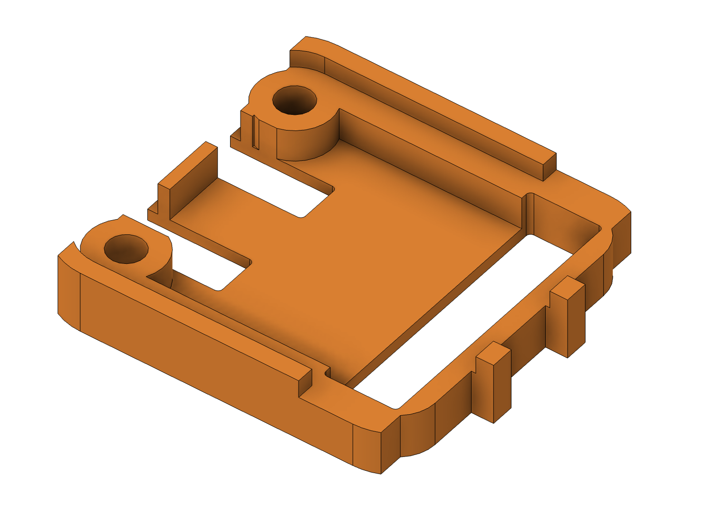
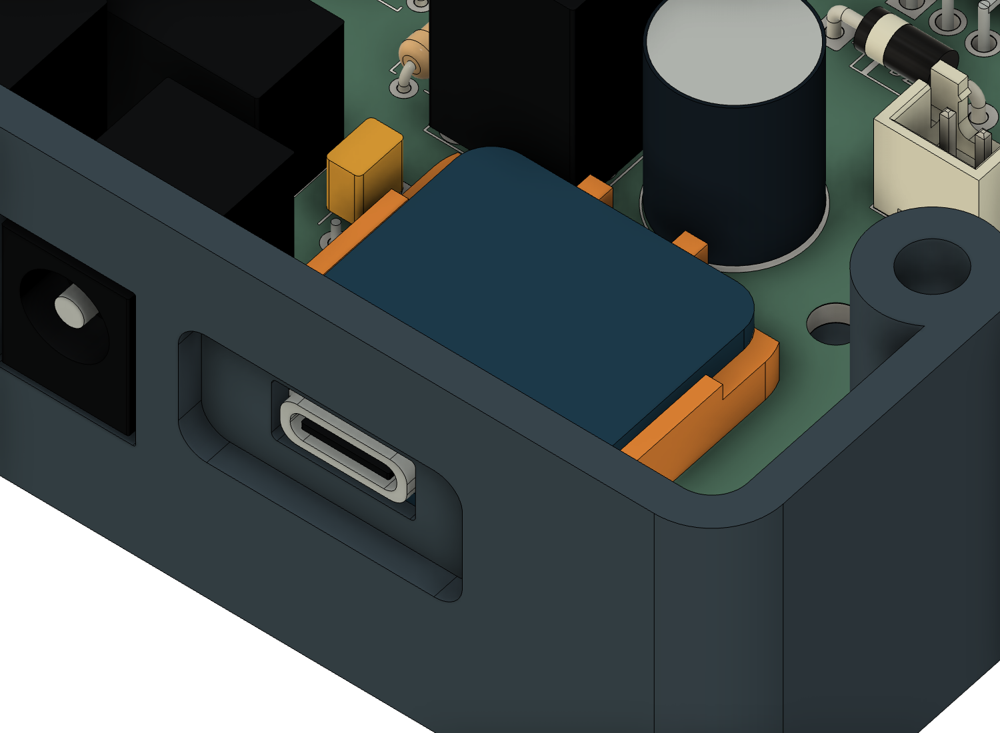

# Adafruit 5807 printed base

This base replaces **both 3 mm nylon spacers and the adhesive rear support**.
It reuses the existing two M2 screws, four washers and two nuts. The four
enclosure parts are unchanged: **no case reprint is needed**.

- [Print STL](../stl/adafruit5807-base.stl)
- [STEP](../step/adafruit5807-base.step)
- Included in the [current R13 Fusion assembly](../pitclaw-enclosure-r13.f3d)



## Fit and hardware

| Feature | Dimension |
|---|---:|
| Base footprint / overall height | 23.32 × 24.995 × 4.2 mm |
| Module underside above carrier | **3 mm total** |
| Floor thickness, included in that height | 0.8 mm |
| Sidewall thickness / board-edge clearance | 1.2 / 0.3 mm |
| M2 holes / pitch | Ø2.4 / 15.24 mm |
| Rear wire gap | 5.1 mm, Eagle u=7.8…12.9 |

The hole positions retain the official board's slight asymmetry; align the USB
end with the end containing the two M2 holes. Do not add the former spacers
under the base. The stack remains:

```text
M2 head → washer → module → printed base → carrier → washer → M2 nut
```

Use the existing hardware within the Ø5 mm envelope. Head plus washer must
remain within 2 mm above the module; the nut/washer/tip stack must remain within
3.3 mm below the carrier. Existing M2×10 screws remain a provisional length;
check their actual engagement and protrusion.

## Install

1. Print flat floor down at 100% scale in millimeters, using the same PETG or
   HT-PLA process as the case. Use the 0.4 mm nozzle profile; no supports are
   needed for this base.
2. Inspect the relief windows and holes. Do not fit a terminal block under the
   module. Trim solder tails to **≤2.5 mm from its underside**, leaving 0.5 mm
   clearance above the carrier.
3. Place the base on the carrier, lower the module onto its bearing surfaces,
   and align both M2 holes. Route the output wires over the module's top through
   the gap between the two rear stops; do not trap them under a bearing edge.
4. Fit the existing washers, screws and nuts. Seat the board without bowing it,
   check the socket position, and tighten both clamps. Check the actual cable
   before installing the carrier in the case.

The reinforced rear stops resist insertion. **The M2 clamps carry extraction**;
the side/front corner guides do not provide a strong front stop within the
case pocket's small clearance. Do not rely on the wires or case wall to retain
the module.



## Evidence and remaining check

The geometry uses the [official Adafruit PCB source](https://github.com/adafruit/Adafruit-USB-Type-C-Power-Delivery-Dummy-Breakout-PCB),
locally `work/pcb-draft/adafruit-5807-husb238.brd`. Underside reliefs cover the
modeled header/output solder, USB shell stakes and locating pegs.
[Native checks](native-verification.json) pass eight seat/stop cases, six
module-descent positions, fourteen solder/peg envelopes and two screw shafts.
Native STL measurements also pass six hole, six bearing/floor and eight open-window
samples. The base's maximum sampled difference from its independent reference
is 0.0022 mm. The seat height and existing case geometry are preserved.

**Physical fit of the new base remains to be checked**, including the actual
board, solder, wires and clamp grip. The images are CAD previews; these checks
do not establish extraction force, material creep or a heat rating.
