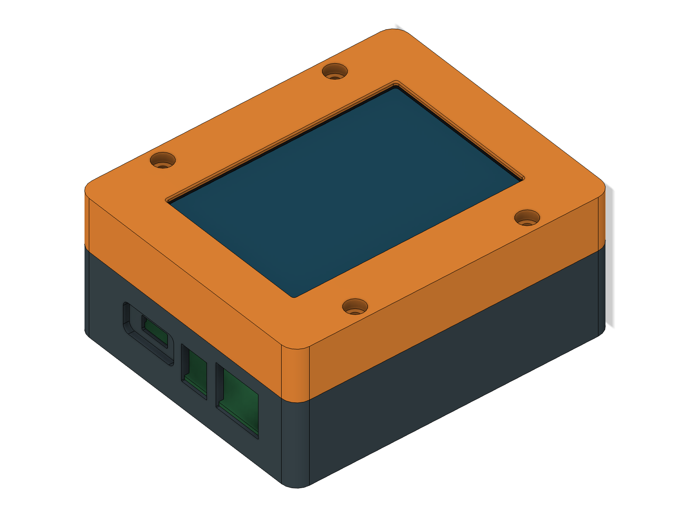
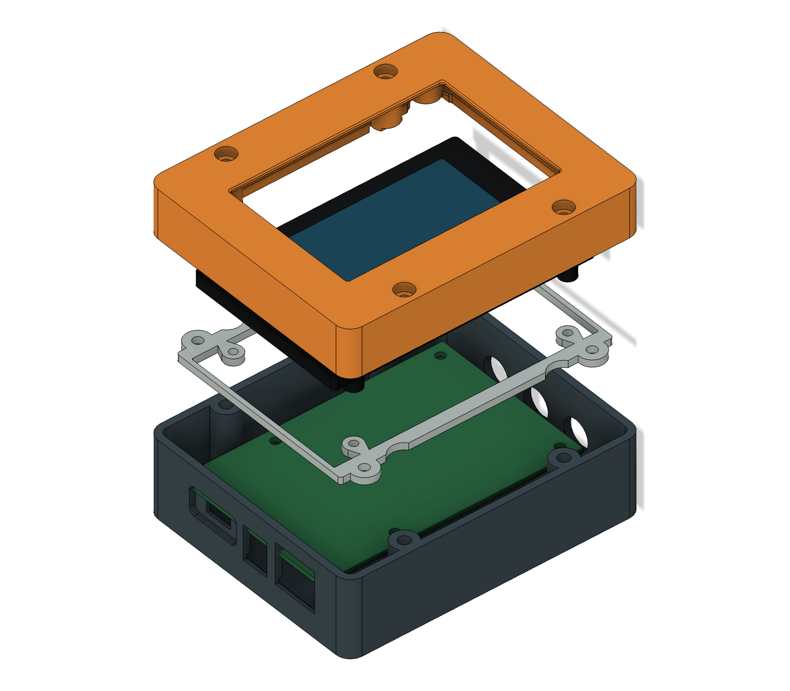

# PitClaw enclosure — native Fusion r8

**Superseded for printing:** importing the actual KiCad PCB exposed a mirrored
power-connector layout in this version. The bottom shell and power-end coupon
need the r9 correction. See [corrected Fusion r9](../fusion-r9/README.md).

Open **[pitclaw-enclosure-r8.f3d](pitclaw-enclosure-r8.f3d)** in Autodesk Fusion.
It contains native solid bodies built from editable sketches, extrusions and a
small loft, with a feature timeline. It is not an imported STL mesh.

The case stays **104 × 86 × 44.9 mm**, with two outer halves, the screen inside
the top and the carrier in the bottom. Power connectors remain on one short
end and the three probe jacks on the other. The USB socket retains its small
fitted aperture within a shallow exterior recess.

## Four-anchor display retainer

r8 replaces the two central retainer anchors with **four anchors at X±35.5,
Y±40 mm**, closer to the WT32 mounting screws. This shortens the load path that
made the r7 retainer susceptible to touch flex. The retainer stays 2.5 mm thick,
and the external enclosure dimensions stay unchanged. Both the top and retainer
must be r8; do not pair one with its r7 counterpart.

The bottom retains the r7 geometry, represented with Fusion's analytic curves.
The existing r7 power-end and insert test coupons still apply.

Use **12 Ruthex RX-M3Sx4.0 inserts total**: four carrier, four outer closure and
four retainer anchors. Retainer screws are now **four M3 × 6 button-head screws**
(head height≤2 mm), giving 3.5 mm nominal insert engagement. The original four
M3 × 18 closure screws and four M3 × 6 carrier screws with 0.5 mm insulating
washers remain. The four separate small WT32 screws still require the actual
module's blind-boss dimensions and suitable thread/length.

Install the WT32/retainer and all four retainer screws from the open rear before
closing the case. Keep the compliant strip's glass preload light and determine
its thickness from the actual display. The four-anchor change has geometric
checks, but no measured stiffness, strength, creep or drop rating.

## Files

| File/folder | Purpose |
|---|---|
| `pitclaw-enclosure-r8.f3d` | Editable Fusion archive, including labeled reference geometry |
| `pitclaw-enclosure-r8.step` | Three enclosure components in assembled positions |
| `step/` | Individual enclosure components as STEP solids |
| `stl/` | Three print-oriented meshes in millimeters |
| `build_fusion.py` | Rebuild script using the Fusion Python API |
| `export_fusion.py` | Native checks, local exports and viewport previews |
| `verify_exports.py` | Mesh integrity and sampled comparison against the independent reference |
| `reference/` | Isolated four-anchor OpenSCAD reference and its verification evidence |
| `native-verification.json` | Native Fusion interference and feature-health report |
| `mesh-verification.json` | Actual export comparison and mesh results |

Fusion component names distinguish **01 Bottom**, **02 Top**, **03 Retainer**
from the two **REFERENCE** components. The bare carrier reference omits placed
components; the WT32 reference is only a nominal mounting envelope. Hide those
references using the browser visibility controls when inspecting the print parts.
They are omitted from the enclosure STEP and printable STLs.

The native model has named parameters for selected axial depths/datums and
`insert_pilot`, which drives all twelve insert bore diameters. Most sketch
positions and profile dimensions are fixed to the reviewed hardware layout and
can be edited directly in the named sketches or rebuilt through the script.
This is not a fully constrained, automatically resizing enclosure family.
Recheck fit after any dimensional change.

The print material remains undecided between PETG and HT-PLA. Colors are display
appearances only; the default Fusion physical material is not a valid basis for
mass or structural analysis. Assign the actual filament properties before using
those analyses.

## Printing

Import files from `stl/` at **100% scale, millimeters**. They already start at Z0:

| Part | Size X × Y × Z, mm | Orientation |
|---|---|---|
| Top | 86 × 104 × 19.3 | Display face down |
| Bottom | 86 × 104 × 27.6 | Floor down, open side up |
| Retainer | 80 × 96 × 2.5 | Flat |

For a 0.4 mm nozzle, use the prior 0.20 mm layer / four perimeter starting profile.
Test the insert and power-end coupons in the actual material first. Inspect
bridges, thin USB skins, the local locating lip and retainer rails in the slicer.
No printer-specific toolpaths were generated. The existing assembly sequence
still applies: lower the carrier 4 mm behind its seated position, slide toward
the power end while 0.3 mm above the bosses, then lower and fasten.

## Verification scope

- Native Fusion: five solid components (three print parts plus two references),
  **zero interference results** with coincident contact faces excluded, and no
  feature health errors or warnings. There are 99 timeline entries including
  component creation, sketches, planes and features.
- Independent four-anchor reference: **12 passing collision scenarios**, covering
  nominal assembly and declared carrier/USB thickness and placement variation.
- All three print meshes are connected, watertight solids with consistent winding,
  positive volume, correct dimensions and their print face at Z0.
- Bidirectional sampling of all mesh vertices, face centers and 5,000 seeded
  surface points per mesh found a maximum Fusion/reference deviation below
  **0.03 mm**. This allowance covers analytic arcs versus SCAD polygons and small
  Boolean construction overlaps; it is a sampled comparison, not a rigorous
  bound on every point of the surfaces.

The original r7 artifacts and the carrier PCB/JLCPCB package were preserved.
Actual connector seating, display dimensions, screw lengths, insert fit, harness
clearance and touch stiffness still require the physical prototype.
