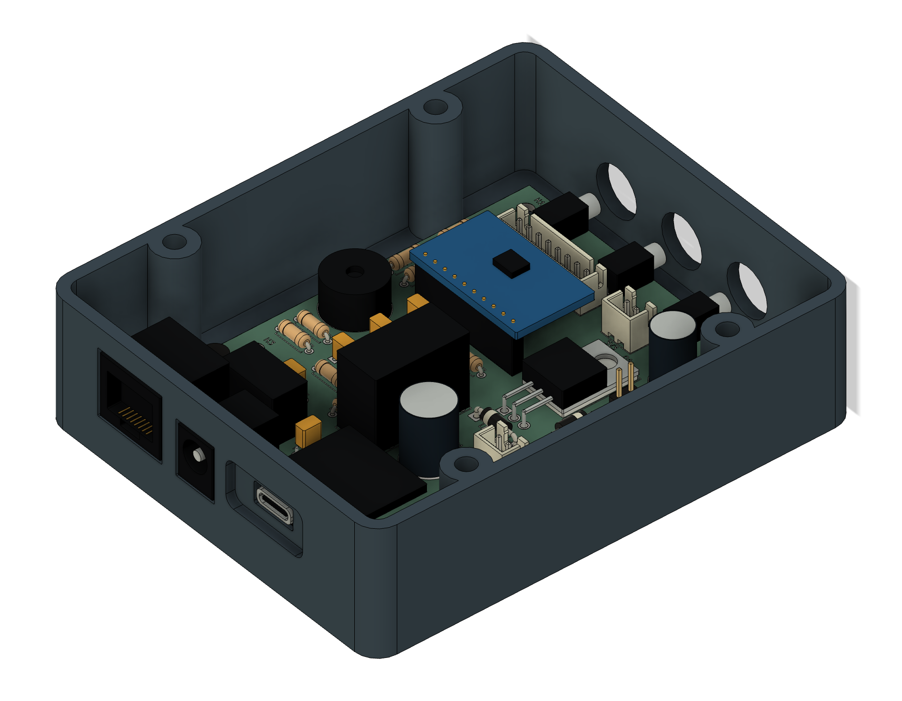
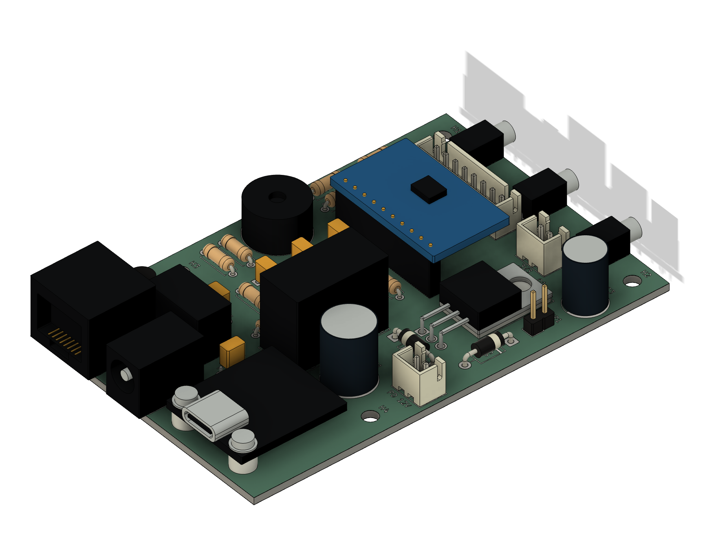
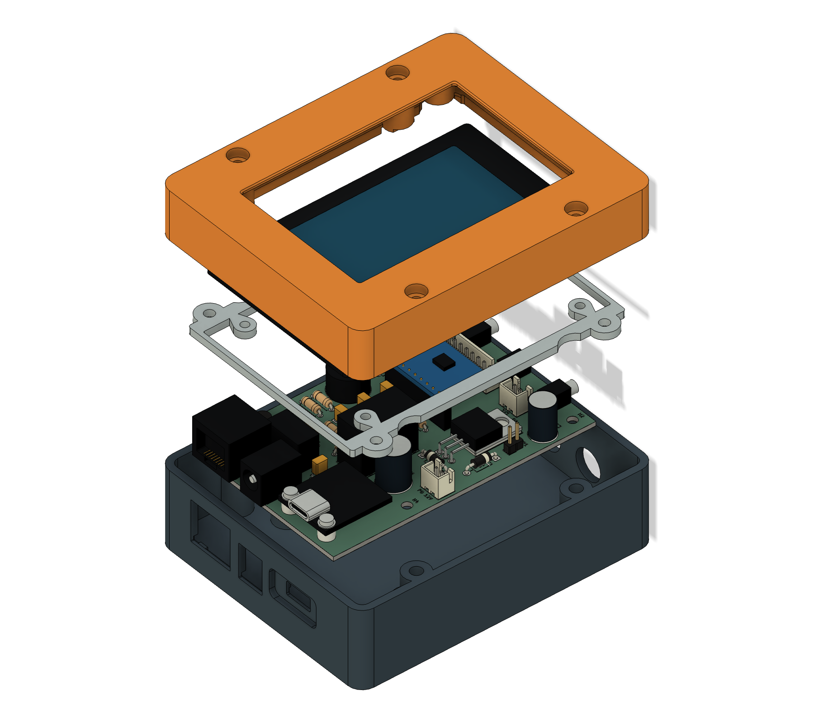

# Populated carrier and corrected enclosure — Fusion r9

**Superseded enclosure:** use the matched four-part [r10 enclosure](../fusion-r10/README.md)
for the relieved probe pocket and reinforced sliding fascia. This r9 model is
preserved as the populated-board and corrected-orientation baseline.

Open [pitclaw-populated-r9.f3d](pitclaw-populated-r9.f3d) in Fusion. The default
view shows the populated carrier seated in the open bottom. Unhide the top,
retainer and WT32 reference components to see the complete assembly.

## Use the r9 bottom and power-end coupon

Importing the actual KiCad STEP exposed a handedness error in the earlier
mechanical coordinate conversion. **The r7/r8 bottom and power-end coupon had
a mirrored power-connector layout. Use the corrected r9 files for these parts.**
The carrier PCB and JLCPCB fabrication files were not changed.

The correction mirrors the bottom geometry across X. The actual KiCad PCB is
placed using a proper 180° rotation around Z and translation (0,4.5,7.5)mm; the
PCB is never mirrored to make it appear to fit. The top and four-anchor retainer
retain their r8 geometry. See [the independent handedness review](handedness-review.md).

The case remains 104×86×44.9mm, with power on one short end and probes on the
opposite short end. Use the r8/r9 four-anchor top and retainer together. The old
r7 top/retainer use two anchors and are not interchangeable with that pair.

## What the populated model contains

- The routed PCB outline, drilled holes, pads, soldermask and silkscreen exported
  directly from the unmodified KiCad board.
- **20 visible KiCad library component instances:** resistors, diodes, JST headers,
  the programming shunt header and the small transistor.
- **17 dimensioned custom carrier models:** capacitors, the flat power MOSFET,
  relay, converter, piezo, RJ45/barrel/probe connectors and socketed ADS1115 module.
- The Adafruit5807 module outline, USB-C connector and mounting spacers/hardware.

All 37 electrical carrier references are represented, plus the USB-C module.
The selected electrolytic capacitor body sizes replace shorter generic library
models. Custom housings, contacts, vents and ADC chip details are simplified
visual geometry. Small USB-module SMD parts and internal wiring are omitted.
These are not supplier-certified models of every purchased part.

The hidden bare-board reference and hidden generic capacitor instances remain
in the Fusion history. The visible populated model supersedes them. Do not
export hidden reference bodies as printable parts.

## Downloads and printing

- `pitclaw-populated-r9.f3d`: native enclosure feature history and populated PCB references.
- `step/`: the three corrected enclosure components, in their assembled coordinates.
- `stl/`: three case parts and two test coupons, oriented for printing in millimeters.
- `populated/carrier-native.step`: original KiCad STEP, in its native coordinate system.
- `populated/custom-model-provenance.json`: source/approximation notes for the custom models.

The STL dimensions and orientations are:

| File | X×Y×Z, mm | Print orientation |
|---|---|---|
| carrier-top.stl | 86×104×19.3 | Display face down |
| carrier-bottom.stl | 86×104×27.6 | Floor down, open side up |
| carrier-retainer.stl | 80×96×2.5 | Flat |
| fit-coupon.stl | 86×22×27.6 | Floor down; corrected power-end geometry |
| insert-coupon.stl | 36×16×7.5 | Flat; 4.0/4.1/4.2mm trial pilots |

Import at 100% scale, millimeters. For your 0.4 mm nozzle, the previous 0.20 mm layer,
four-perimeter starting settings still apply. Inspect bridges and thin-wall paths
in the slicer. Print both coupons before the complete case in the chosen material.
The supplied case pilots are 4.0 mm; if a coupon indicates a different pilot, adjust
`insert_pilot` and re-export the affected case parts.

Hardware remains **12 short M3 inserts**: four carrier, four case closure, four
retainer anchors. Use four M3×6 retainer button-head screws, four M3×18 closure
screws, four M3×6 carrier screws with 0.5 mm insulating washers, and four correctly
sized small WT32 blind-boss screws. USB mounting uses 3 mm spacers and hardware
within the reviewed Ø5 mm envelope. Verify actual engagement and glass-pad preload.

## Verification

- The corrected independent reference passes 12 modeled assembly/tolerance checks.
- Native Fusion checked 127 overlapping body bounding-box pairs with actual solid
  Boolean intersections: **no positive-volume component-to-case clashes** in the
  checked nominal geometry. Real feature/sketch collections have no health errors
  or warnings. Internal package overlaps and cosmetic copper/mask/silk sheets are
  excluded from this test.
- The PCB rotation/translation is captured in the Fusion timeline and asserted
  numerically, so later feature edits cannot silently reset its placement.
- Native enclosure meshes are compared against the corrected reference, using
  bidirectional surface samples and a 0.03 mm geometric allowance for analytic arcs
  versus SCAD facets and small construction overlaps.

These checks do not establish physical fit, material stiffness, operating
clearance of every cable, heat performance or screw preload. The STEP layer
heights are rendering datums: substrate starts at 7.5 mm and component origins at
9.095 mm; this does not redefine the nominal 1.6 mm PCB thickness.

`upgrade_fusion_r9.py` upgrades the five-component r8 model. It mirrors the bottom,
imports the native STEP and calls `populate_custom.py`, then captures the proper
PCB placement. `export_populated.py` generates the native exports and previews;
`check_native_r9.py` checks the component/case intersections. The copied r8 builder
in `support/` is a geometry dependency, not a separately approved print revision.
