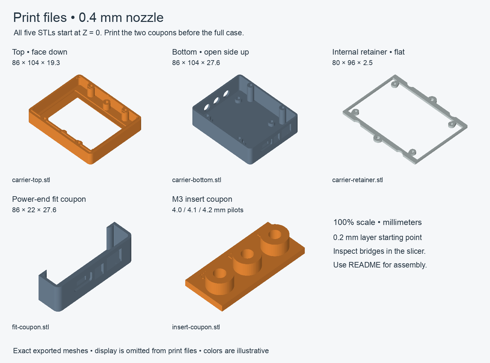

# PitClaw carrier case r7 — print and assembly guide

**Fit prototype for the routed Rev B 60 × 92 mm carrier and WT32-SC01 Plus.**
The assembled case is 104 × 86 × 44.9 mm. It has two outer halves and a thin
internal display retainer. Power connections are on one short end; probes are
on the opposite short end. The relay power-selection design is unchanged.

All five files are watertight, single connected solids in millimeters. **Import
at 100% scale.** They already have the intended print face at Z0. STL carries no
unit metadata, so confirm the dimensions below in your slicer.

| File | Qty | Size X × Y × Z, mm | Orientation |
|---|---:|---|---|
| [carrier-top.stl](carrier-top.stl) | 1 | 86 × 104 × 19.3 | Display face down |
| [carrier-bottom.stl](carrier-bottom.stl) | 1 | 86 × 104 × 27.6 | Floor down, open side up |
| [carrier-retainer.stl](carrier-retainer.stl) | 1 | 80 × 96 × 2.5 | Flat |
| [fit-coupon.stl](fit-coupon.stl) | 1 first | 86 × 22 × 27.6 | Floor down, same as bottom |
| [insert-coupon.stl](insert-coupon.stl) | 1 first | 36 × 16 × 7.5 | Flat base down |

## Start with the coupons

Print both coupons in the material and settings you plan to use for the case.

The **power-end fit coupon** is an exact section of the bottom shell, including
all three ports, the recessed USB face, hidden hardware clearances, carrier-edge
channel and passive supports. Test the actual USB cable boot, barrel plug and
RJ45 latch with the populated carrier/USB module. The full PCB extends beyond
the coupon: support it level. This coupon does not establish the fit of the four
M3 carrier mounts or the display.

Fit the USB module on 3 mm spacers. Its M2 holes allow some movement: locate its
socket face against the intended recessed-floor position before tightening the
screws, without forcing it into the plastic. The modeled lateral test is X±0.2 mm;
longitudinal placement is not swept by that test. Hidden PCB/head relief has
only 0.2 mm longitudinal allowance. Verify the plug still seats fully.

The **insert coupon** has three Ø9 mm bosses over a 2.5 mm closed floor. From
left to right with the labels upright, the blind pilots are **4.0 / 4.1 / 4.2 mm**
in diameter and 5 mm deep. The left engraving reads “4”. Trial the specified
4 mm-long M3 insert, inspect the boss for cracks or distortion, and check screw
engagement. The supplied case STLs use the **4.0 mm pilot**. If another pilot
works better, change `insert_pilot` in `source/carrier-case.scad` and re-export
the top and bottom before printing them. Do not scale the whole case to adjust
one hole; scaling also changes connector and mount spacing.

## Suggested starting settings — 0.4 mm nozzle

| Setting | Starting point |
|---|---|
| Layer height | 0.20 mm |
| Perimeters | 4 |
| Top/bottom solid layers | 5 |
| Infill | 25% |
| Scale | 100%, millimeters |
| Temperature, bed surface, cooling | Your printer/filament manufacturer's profile |
| Supports | Inspect local bridges and use removable local support where needed |

These are starting settings, not a tested printer profile or generated G-code.
With a 0.4 mm nozzle, roughly 0.45 mm extrusion width is common; thin features
cannot contain four perimeters simply because four were requested. Inspect the
actual paths through the approximately 0.94–0.98 mm USB skins, 0.8 mm web, 1.0 mm
channel skin, 0.7 mm local lip and 1.6 mm retainer rails. Confirm the slicer retains
continuous material. [Prusa's modeling guidance](https://help.prusa3d.com/article/modeling-with-3d-printing-in-mind_164135).

Inspect the port roofs (including the 16.75 mm RJ45 opening), circular probe
openings, blind channels and the top's recessed screw holes. Remove supports
without damaging the thin skins before test assembly. The power coupon shows
how these features behave with your settings.

**PETG is my suggested first fit print** for its toughness and low warping, using
your normal profile. Pay attention to bridges and support removal, which can be
more difficult in PETG. [Prusa PETG guide](https://help.prusa3d.com/article/petg_2059).

**HT-PLA is also an option**, but its behavior depends on the product. If its
manufacturer requires annealing for the desired heat performance, process and
measure the coupons before deciding case compensation, then repeat all fits
after processing the full parts. Annealing can change dimensions differently
by axis; a coupon does not establish the warping of a complete shell.
[Proto-pasta's measured HTPLA example](https://proto-pasta.com/blogs/how-to/heat-treating-carbon-fiber-htpla-for-accurate-heat-resistant-parts).
No thermal rating for this enclosure has been established.

## Hardware

| Qty | Hardware | Use / limit |
|---:|---|---|
| 10 | Ruthex RX-M3Sx4.0 short heat-set inserts | 4 carrier, 4 closure, 2 retainer anchors |
| 4 | M3 × 6 screws + 0.5 mm insulating washers | Carrier; washer OD≤7 mm; 3.9 mm nominal engagement |
| 4 | M3 × 18 screws | Closure; head OD≤6 mm, height≤3 mm; 3.9 mm nominal engagement |
| 2 | M3 × 6 button-head screws | Retainer anchors; head height≤2 mm; 3.5 mm nominal engagement |
| 4 | Small screws matched to WT32 rear blind bosses | Diameter, thread and length require the actual module |
| 1 | Compliant perimeter strip | Inactive display border; provisional compressed thickness 0.3 mm |
| 2 | M2 × 10 screws, provisional length | USB module to carrier; verify actual engagement |
| 4 | M2 washers, OD≤5 mm | One above module and one under carrier at each screw |
| 2 | 3 mm nylon spacers, OD≤5 mm | Between USB module and carrier |
| 2 | Ordinary M2 nuts | Under carrier; total hardware projection≤3.3 mm |
| 1 | 3 mm insulating adhesive support | Under USB module's free end; clear components/solder |

The M2 head and top washer together must project no more than 2 mm above the USB
module. Keep screw heads≤Ø4 mm. Do not substitute large/locking hardware without
measuring its envelope. Use the [specified insert](https://www.ruthex.de/products/ruthex-gewindeeinsatz-m3s-100stuck-rx-m3x4-0-short-messing-gewindebuchsen-fur-3d-druck)
or revise the pilot/boss for your actual insert. Nominal case pilots are Ø4 mm,
5 mm deep, with a Ø9 mm boss; inserts are Ø4.6 × 4 mm long.

## Assembly sequence

1. Print and test the coupons, then print the three enclosure parts. Remove
   support, strings and first-layer burrs. Test the empty shell seam and retainer.
2. Install inserts squarely before electronics. Check the carrier's four M3
   holes align without forcing the PCB; the PCB's Ø3.2 mm mounting holes allow
   little positional error. Do not pull a misaligned board into place with screws.
3. With the WT32 face down on a soft surface, attach the retainer to its rear
   blind bosses using suitable small screws. Ensure it clears rear components.
4. Seat the display/retainer in the top with the compliant strip on the inactive
   glass border. Fasten the two retainer anchors. Verify preload from the actual
   dimensions: tightening must not bow or clamp the glass.
5. Mount the USB module on the carrier using the verified M2 stack. Trim solder
   tails to ≤3 mm. Start the populated carrier **4 mm toward the probe end** from
   its final position. Lower it to **0.3 mm above the carrier insert bosses**,
   slide it **4 mm toward the power end**, then lower the last 0.3 mm. Install the
   four M3 screws and insulating washers. Reverse the sequence for removal.
6. Fit all external plugs fully, exercise the RJ45 latch and check probe plug
   reach into the 7.5 mm recess. The probe bore axis assumes the jack housing
   seats as drawn; confirm the actual sample.
7. Route the internal harness with a service loop. Keep the complete ADC/harness
   height within 16 mm above the carrier; Q1 must be flat within 6.5 mm. Check the
   WT32's real rear connectors and cables independently of its mounting datum.
8. Close the top and tighten the four M3 × 18 screws gently. The seam should seat
   freely without trapping wires or changing the glass preload. Do not bottom
   screws in inserts or WT32 blind bosses.

## What was verified

The [final CAD/mesh report](fit-verification.json) passes 12 geometric scenarios:
11 empty collision intersections and only intentional zero-thickness seam
contact in the shell-closure check. All five supplied STLs are single connected,
watertight meshes with consistent winding and the expected dimensions.

The high/low cases cover carrier and USB PCB thickness 1.44–1.76 mm, USB spacer
height 2.9–3.1 mm, carrier edge growth 0.2 mm and USB X shift ±0.2 mm. These declared
allowances do not include all vendor tolerances or printer error. The geometry
includes placed carrier component envelopes, full M2 spacers/heads/nuts, M3
carrier heads, and underside solder/peg envelopes. Physical plug bodies, wire
bends, WT32 rear components, screw selection and glass preload remain fit tests.
See [independent review](final-review.md). No physical print or slicer toolpath
validation was performed.

`source/carrier-case.scad` and `source/carrier-interface.scad` are a matching
self-contained source pair. In OpenSCAD select `part="top"`, `"bottom"`,
`"retainer"`, `"fit-coupon"` or `"insert-coupon"`, render and export STL. Run the
repository's `enclosure/tools/verify_case.py` again after geometry changes.
The package manifest records checksums. Earlier r6 STL files are superseded by
these r7 files for the current carrier.
